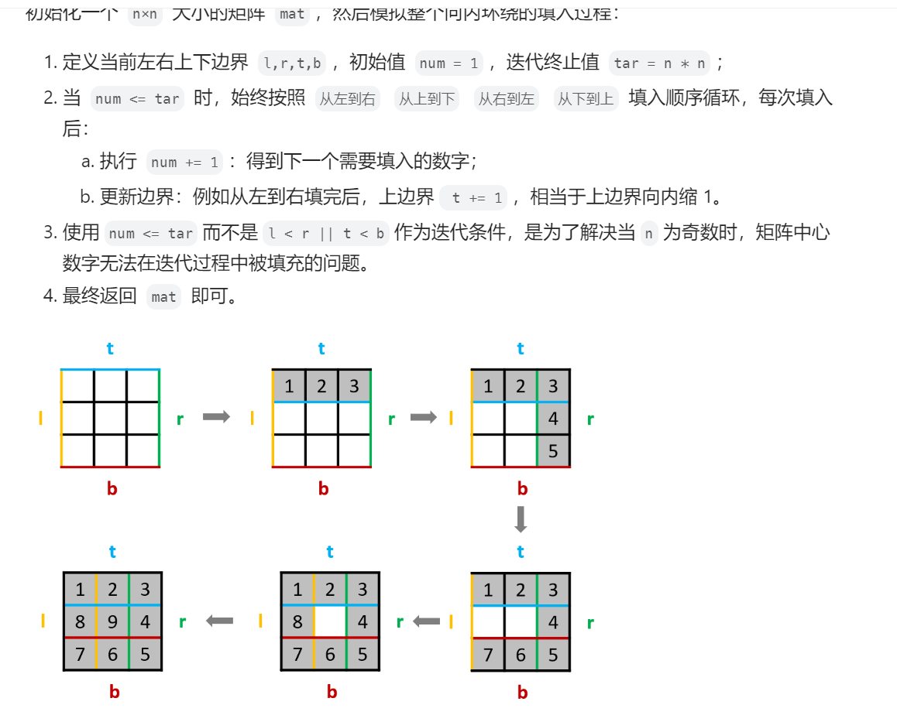

## 子串匹配

1、滑动窗口

核心思想是，start、end两个指针开始于0，还有num指向目标的当前达成情况，以及一个计数器类指针count以指示最优字串。

首先向右滑动end直至完成目标，计数；

然后num-array.at(start)，start+1，继续向右滑动end直至完成目标，如果当前end-start优于原count，则更新count；

持续直到end或者start到达边界；（在while condition判断start到达边界;在while体内滑动end函数中判断end到达边界）

最后的count即为达成目标的最优字串。

## 二分查找

关键点在于跳出循环的判断，left指针大于right指针时即为跳出循环时刻。

## 移除元素-原地移除

（原数组有序且移除后不可乱序）核心在于一个指向由于被移除元素而空出位置的空闲指针，另一个遍历指针只要遍历的是非目标元素则移动到空闲指针所指位置，原数组的长度-空闲指针最后位置即为数组中目标元素的个数。

## 有序数组的平方

难点在于存在负数和正数，平方后会变序。

核心在于两个指向数组头start和尾end指针，头尾比较，小值移动到start（要求增序移动到start，降序移动到end），大值的平方移动到end；

end-1，继续和start比较直至start和end相等。

## 螺旋矩阵

核心思想在于设置四个边界值，分为向右填充、向下填充、向左填充、向上填充四种情况，并设置一个count用于填充数字。

每个填充为一个循环，循环终止值为填充方向边界，一个循环中的每次迭代count++，每个填充循环结束后将某个边界值--，循环出口为count<=n*n。

