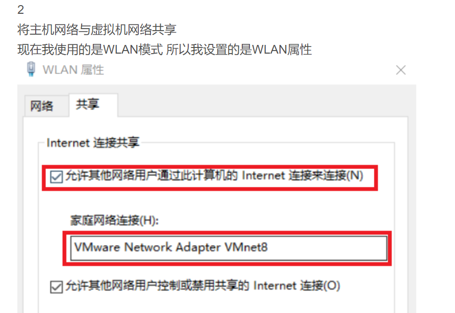

### 特别注意：代理必须设置为主机wan的ip，不能设置为lan或者虚拟网卡网关的ip

1、这一步可有可无

2、allow-lan

3、配置proxychains4

apt可以安装

vim /etc/proxychains4.conf

注释掉strict_chain，将dynamic_chain注释符删掉

删除socks4那行，改成socks5 主机ip 代理端口。（主机ip是wan的ip，不能是虚拟机网卡网关ip）

4、用proxychains4作为开头打开某个软件即可

例如：proxychains4 firefox google.com