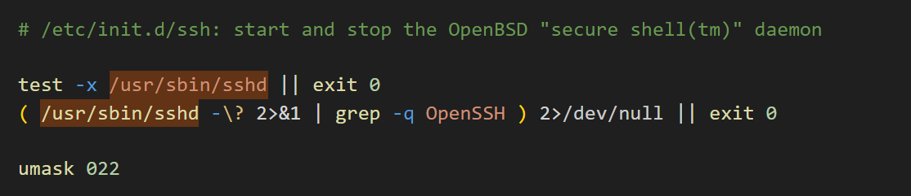
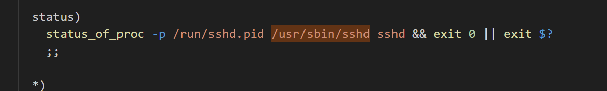

## 安装ssh服务端

sudo apt install openssh-server //安装

sudo systemctl restart ssh  ||  sudo service ssh restart  //不同系统不一样，二选一

## 配置文件

sudo vim  /etc/ssh/sshd_config    //配置文件位置

PasswordAutentication   yes //允许密码登录

PermitRootLogin yes   //允许root用户登录

## 密钥登录

PasswordAutentication no  //关闭密码登录
ChallengeResponseAuthentication no  //挑战响应机制取消
PubkeyAuthentication yes  //密钥登录开启

## 配置密钥对

1、ssh-keygen -t rsa -b 4096  //在请求机（客户端）生成密钥对,默认位于~/.ssh/下，名为id_rsa。公钥为id_rsa.pub

2、将公钥传到服务端的~/.ssh文件夹下authorized_keys中，如果没有可以新建（密钥配置文件路径信息在ssh配置文件中）。新建命令：

mkdir -p ~/.ssh
chmod 700 ~/.ssh
touch ~/.ssh/authorized_keys
chmod 600 ~/.ssh/authorized_keys

cat ./id_rsa.pub >> ~/.ssh/authorized_keys   //将公钥信息追加入该文件

还可以一个命令解决：cat ./id_rsa.pub | ssh username@server_address "cat >> ~/.ssh/authorized_keys"

***客户端ssh登录时的命令需要添加私钥，ssh -i ~/.ssh/id_rsa 用户名@服务器地址 -p 端口号***

## SSH开启多个端口，每个端口配置文件不同

1、复制一份/etc/ssh/sshd_config文件为/etc/ssh/sshd_config_custom

2、更改该配置文件为需要配置，且更改port为需要开启的端口号

3、运行第二个ssh示例：sudo /usr/sbin/sshd -f /etc/ssh/sshd_config_custom

4、重启ssh服务

## 开机自启（init类型）

```bash
service ssh start  //启动ssh

//默认ssh端口开机自启
sudo update-rc.d ssh defaults //在/etc/init.d/下设置ssh启动脚本为开机自启

//自定义监听端口开机自启
sudo cp /etc/init.d/ssh /etc/init.d/ssh_custom 
sudo vim /etc/init.d/ssh_custom //修改其中的start启动部分，在/usr/sbin/sshd后添加 -f /etc/init.d/ssh_custom  
sudo chmod +x /etc/init.d/ssh_custom  //使脚本可执行
sudo update-rc.d ssh_custom defaults //在/etc/init.d/下设置ssh_custom设置开机自启


//PS:不修改的部分在下图（即头和尾两处不用加，别的都加）
```



