## 卸载之前的操作系统并重新硬盘分区

1、开机按f10

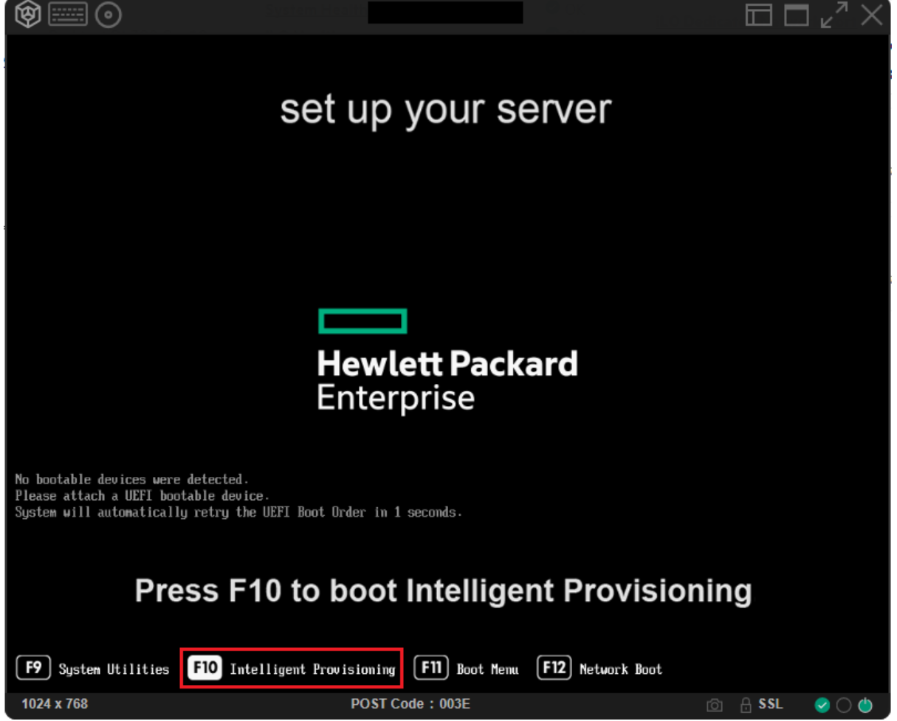

2、选择这个

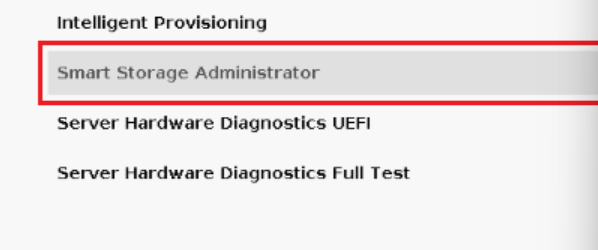

3、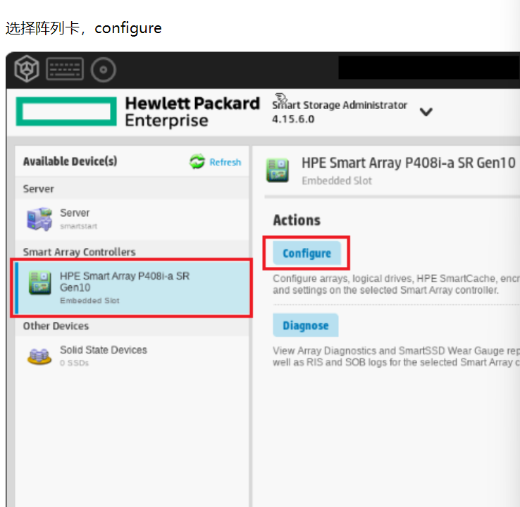

4、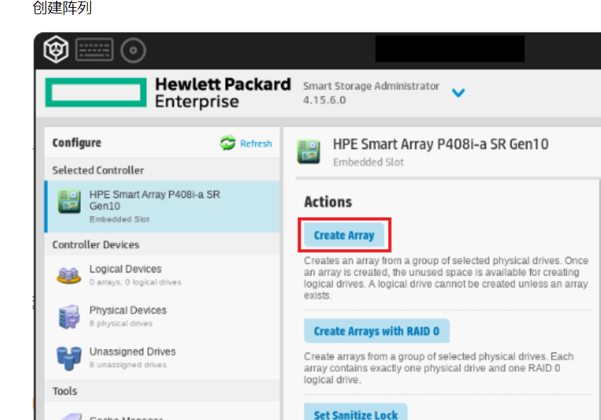

5、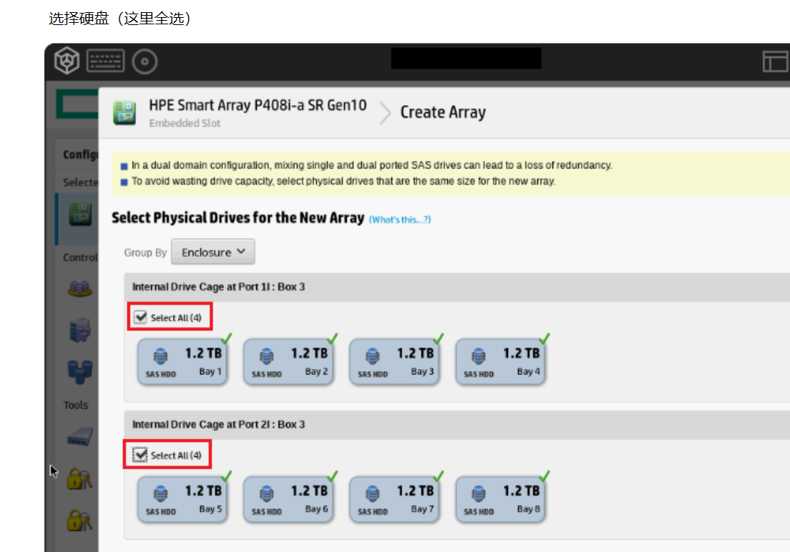

6、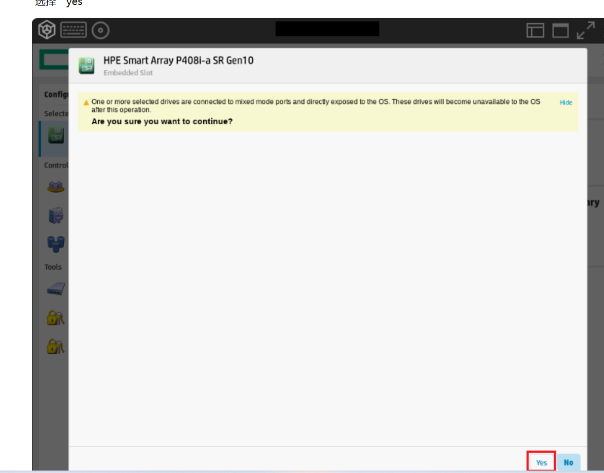

7、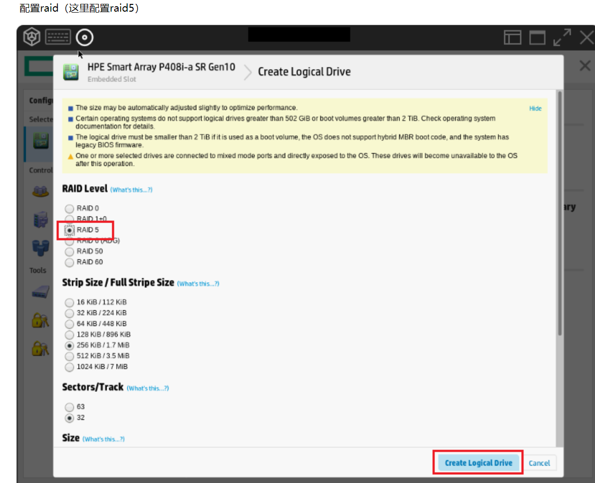

8、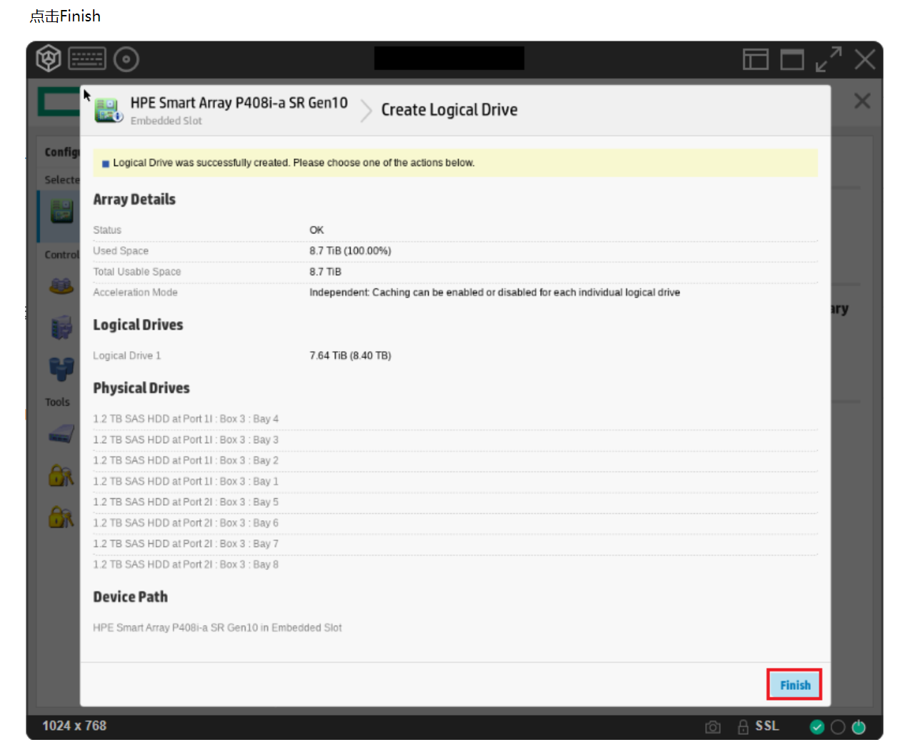

9、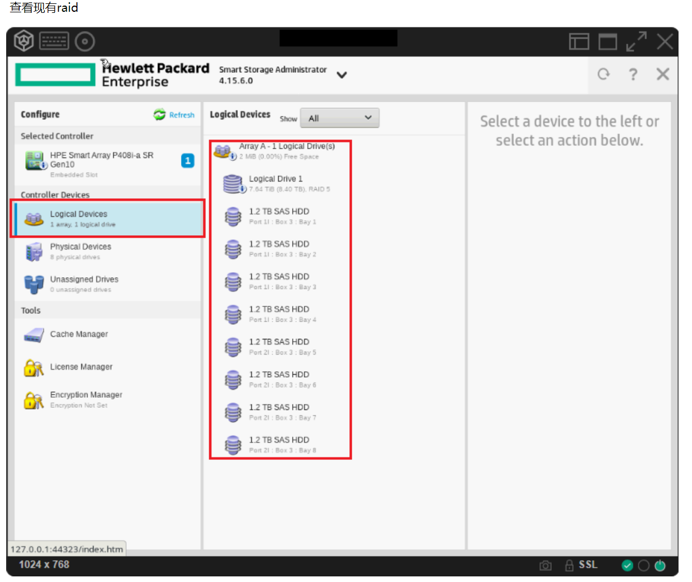

10、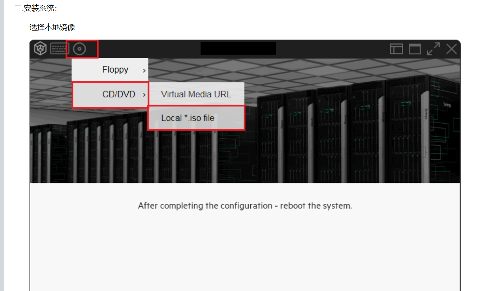

11、重启后会自动进入系统安装界面（如果用u盘装就不用载入iso，分区完直接重启）

## 特别地，在使用u盘安装操作系统时

用rufus，特别的如果安装时出现了找不到安装介质的错误，应该在写入时以dd模式写入。

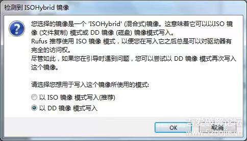

如果还不行，查阅以下网页https://zhuanlan.zhihu.com/p/558879155

## 更改hp-iLO密码

f9以后有个user management的选项，在里边可以直接更改管理员密码