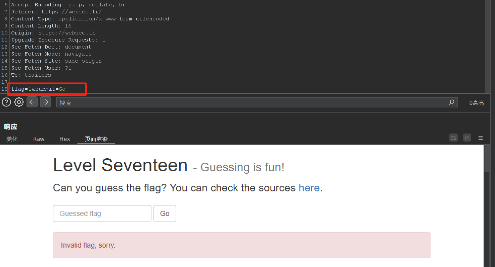
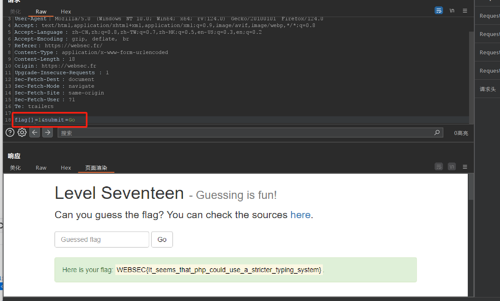
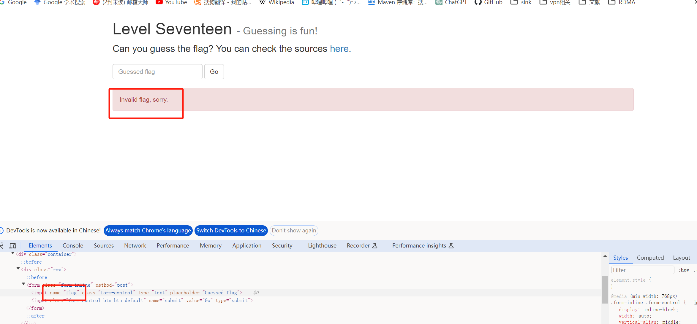
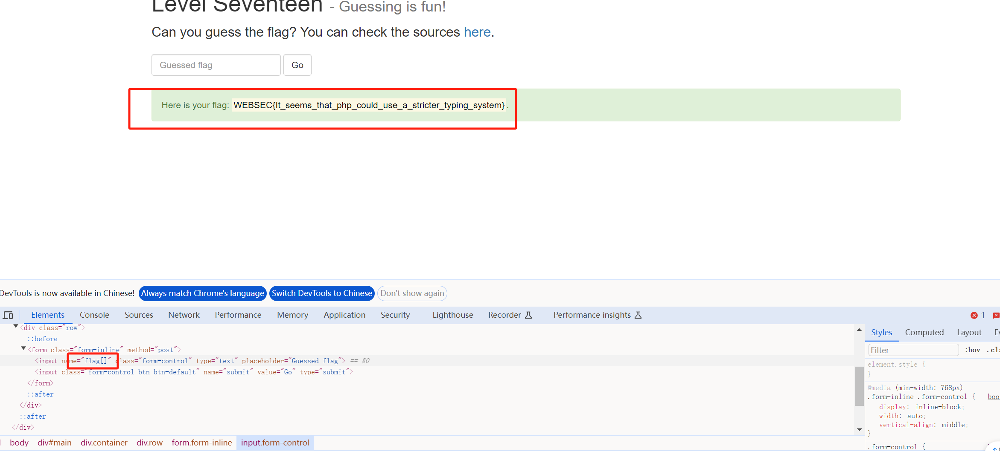
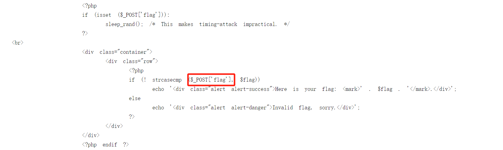

## 特点

PHP是一种动态语言类型，可以在前端html中编辑提交表单中的name字段从而改变提交的数据类型，PHP会自动接受这个数据类型并在运行时将赋值的变量自动转化为该类型。

如果name字段为flag，即没有[]时，所有数据都默认以字符串发送，即不论用户在输入字段中填写的是数字、字母还是其他任何字符，当数据到达服务器时，PHP 都将其视为字符串类型。

但当 HTML 表单中的元素name属性以[]结尾时，这会告诉 PHP 该处理提交的数据为数组。在发送的http中表现为***如下区别***：

#### html中的name不以[]结尾时，即name="flag"。



#### html中的name以[]结尾时，即name="flag[]"。



因为php在使用$_POST['flag']时，无论是数组还是字符串都可以被直接这样使用，所以不会报错。例如：

```php
$a = $_POST['flag'];//无论html传过来的是name="flag[]"还是name="flag",都可以直接赋值给a，a会自动判断flag的类型（字符串或者数组）。只不过使用$a时需要遍历取出数据，而不能直接使用。
```

### 例子：

name="flag"



name="flag[]"



php代码，如果传入的POST内容是数组，strcasecmp()函数在对比数组和字符串时会返回0，即认为其相等，然后导致执行第一个echo，得到flag。

