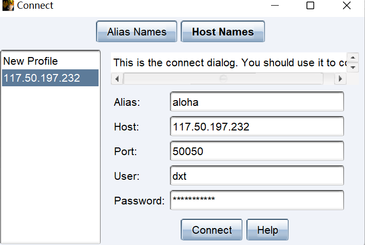
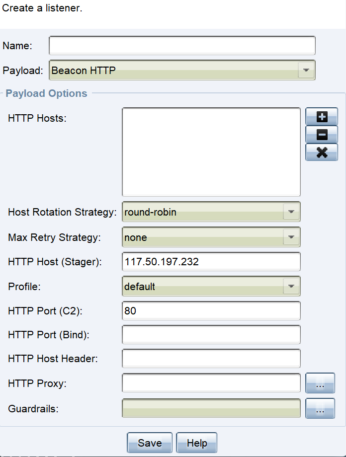

## 简介

它曾经和msf是一体的，后来逐渐脱离出来，成为UI界面版的msf，它和msf互相有更强的点，因此经常需要将会话在他们之间进行派生。

## 前提条件

需要jdk，而且对jdk的版本有一点的要求，好像新版的需要jdk17。

## 安装

文件夹下有zip，内有server侧和client侧，解压即可用，s仅能在linux上运行，c可以在windows、linux上运行，但是要改一下c的.cmd文件为linux的脚本格式。

## 运行

### Server

（可能需要先给server文件root权限），先为teamserver和teamserverimage赋予可执行权限。

server默认开启的监听客户端连接的端口是50050。

```bash
chmod +x xxx

./teamserver ip passwd  //ip为服务端ip，passwd为cs客户端连接认证的密码
```

### Client

直接运行.cmd文件，弹出登录界面。



alias是别名，host为server的ip，port为server开放给客户端连接的端口，user是登录的用户名自设置，password为server开启时设置的passwd。


## listener

cs的核心，cs一切围绕listener展开，监听器既可以用来监听靶机执行木马后的连接，还可以用来在靶机上下载文件等。



监听器之所以要设置payload是和msf的handler一样的作用，需要根据真实的payload设置具体的监听方式。

http hosts代表当得到session时，把这个会话分配到哪个ip上去，一般设置为cs服务端自身ip即可。

http host为要在哪个ip上创建监听器，一般为cs服务端自身ip。

http port(C2)为要在这个ip的哪个端口上创建监听器来接收靶机的连接。


## Paloads

pyaload栏即为msf的msfvenom，用于生成木马。

## Attacks

该栏中最重要的是scripted web delivery,它和msf的web delivery是一样的作用。


## SiteManagement

manage中为所有监听器上承载的内容和可下载的内容。

host file为利用监听器上传一个木马，从而靶机可以通过访问这个监听器木马所在的url访问并下载这个木马，从而进行执行。

