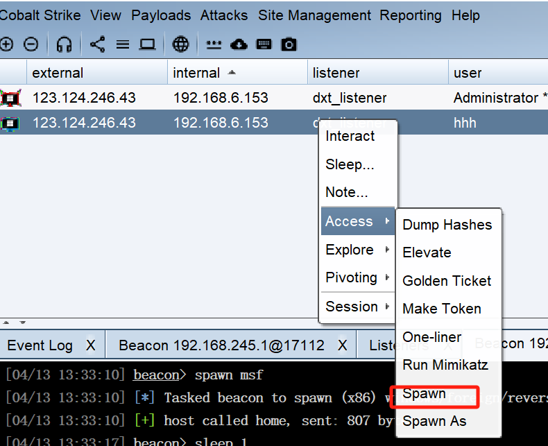

## 简介

将cs获得的session转发到msf的meterpreter，利用meterpreter对靶机进行操作

## 可互相主动访问的情况

#### msf可以主动访问到cs的服务端，cs服务端也可以主动访问到msf。

用msf的exploit/multi/handler创建一个本地监听，LHOST和LPORT都是本地的，但是要设置**payload为cs创建的外部监听器的payload**。

在cs上创建一个foreign listener,用于监听**非本机**——即外部某ip的某port，即msf的handler在msf本地监听的ip和port，payload和msf的handler的payload对齐。

然后选择Spawn把session转移到外部监听器即可



## 仅单向主动访问的情况

#### msf可以主动访问到cs的服务端，cs服务端不可以主动访问到msf。

此时需要用到ssh端口转发，先在cs服务端开启ssh端口转发，然后再在msf侧配置msf和cs之间的ssh端口转发策略。

```bash
###cs服务端ssh配置
sudo vim /etc/ssh/sshd_config  //ssh_config是ssh客户端配置，sshd_config是ssh服务端配置
##ssh配置文件更改
AllowTcpForwarding yes
GatewayPorts yes
TCPKeepAlive yes
PasswordAuthentication yes
##
sudo systemctl restart sshd.service
###


###msf配置端口转发策略
ssh -f -C -N -g -R 7777:192.168.6.149:5678 ubuntu@117.50.197.232 -p 22
###这条命令的意思是先通过ssh建立和cs服务器117.50.197.232的ssh连接，然后可以通过这个shell向cs服务器配置ssh的端口转发，使得cs服务器的7777端口可以映射到msf服务器192.168.6.149上的5678端口，此时访问cs的7777就像访问msf的5678端口一样，此时就可以配置cs的外部监听器了
```

配置cs服务端外部监听器为117.50.197.232:7777，配置msf的handler监听5678端口后，cs服务端对要派生的session spawn到外部监听器即可。