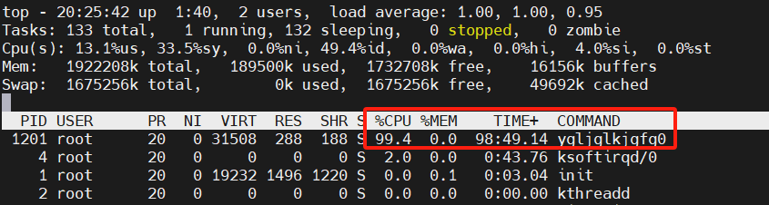
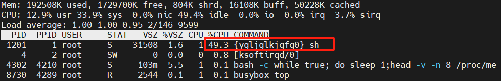
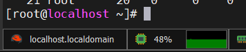
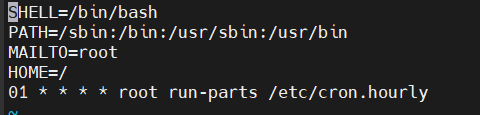
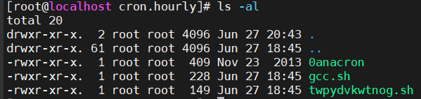
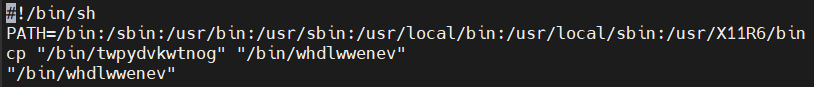
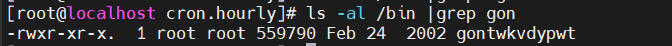
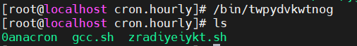
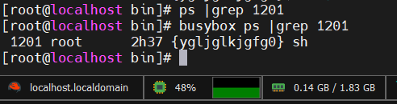
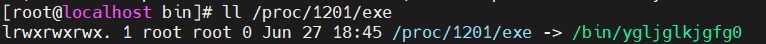

1、为什么用top看到的cpu占用率是98%左右，但是用busybox或者ssh工具（mobaxterm）看到的占用率仅有50%？







2、定时任务/etc/cron.d下有一个0hourly定时执行/etc/cron.hourly文件，查看其下所有文件，gcc.sh和0anacron感觉都是正常的，仅twpydvkwtnog.sh文件看起来有问题。





twpydvkwtnog.sh将/bin/twpydvkwtnog原地复制一份并改名为whdlwwenev，但是不知道最后一行的"/bin/whdlwwenev"是什么意思呢？实际测试发现，在执行该脚本后/bin/twpydvkwtnog并没有复制出一份并改名为whdlwwenev，这是为什么呢？

而且有意思的是还有一个文件名是twpydvkwtnog的反转即gontwkdypwt,他俩的大小一模一样





3、在执行twpydvkwtnog文件后原有的twpydvkwtnog相关的文件都变成了zradiyeiykt，包括twpydvkwtnog的反转名文件gontwkdypwt也变成了zradiyeiykt的反转名文件tkyieyidarz。（再多次执行该文件也是同样的文件变名字但功能不变，且反转名文件与正常名文件有同样的执行效果。不仅如此，直接在删除该.sh脚本和可执行文件的结果和执行可执行文件的结果是相同的）

但是占用CPU的进程ygljglkjgfg0并没有丝毫变化，还是处于运行状态。



4、用ps看不到1201这个进程，但是busybox可以，这是攻击者修改了ps工具吗



用ll /proc/pid_id/exe查看到其



5


以下是详细版流程，适用于初步排查病毒但没有探查到的情况，进而需要全面排查。而初步排查只需要每个步骤执行开始的一小部分即可。


1、首先查找可疑用户，记录好可疑信息。有可疑用户先对该可疑用户进行history搜查，没有可疑用户则可能是利用其它用户身份的shell，对其它用户进行history搜查。

**history搜查**：如果是在当前用户终端直接执行可疑命令，history会存有可疑命令的历史记录，可以ps查找以该用户身份执行的可疑程序进行初步筛查；然后查找history是否用sudo以它人身份运行恶意命令（此时ps查找以该被利用用户身份执行的可疑程序）或者用su切换到了它人身份去进行下一步操作（此时对该被利用用户执行同样的history搜查）；最后查看其history运行的可疑脚本（包括用sudo运行的脚本）以分析是否在脚本中执行了可疑命令（因为脚本文件中运行的命令不会被记录在history中）。

```bash
#####用户相关命令
#1、查找可疑用户
w或who //查看当前登录用户（tty代表本地登陆  pts代表远程登录）
uptime //查看用户登录时间、数量
#2、在/etc/passwd查询特权用户,在/etc/shadow查询可以远程登录的用户
awk -F: '$3==0{print $1}' /etc/passwd
awk '/\$1|\$6/{print $1}' /etc/shadow
#3、查看哪些用户存在sudo权限，尽可能避免发放该权限
more /etc/sudoers | grep -v "^#\|^$" | grep "ALL=(ALL)"
#4、禁用、删除可疑帐号
usermod -L user //禁用帐号，帐号无法登录
userdel user //删除user用户，加-r将/home目录下的user目录一并删除
```

```bash
#####历史相关命令
#1、查看当前用户的命令历史
history
#在各用户家目录下的.bash_history中查看各用户的命令历史

#2、让命令历史收集更多数据、更好分析
#(1)保存1万条命令
sed -i 's/^HISTSIZE=1000/HISTSIZE=10000/g' /etc/profile
#(2)在/etc/profile的文件尾部添加如下行数配置信息：
######jiagu history xianshi#########
USER_IP=`who -u am i 2>/dev/null | awk '{print $NF}' | sed -e 's/[()]//g'`
if [ "$USER_IP" = "" ]
then
USER_IP=`hostname`
fi
export HISTTIMEFORMAT="%F %T $USER_IP `whoami` "
shopt -s histappend
export PROMPT_COMMAND="history -a"
######### jiagu history xianshi ##########
#(3)source /etc/profile让配置生效

#3、清除历史命令
history -c
#担并不会清除在.bash_history文件中的命令历史记录。
```

2、利用netstat -atunlp或者ss -altunp查看可疑端口及异常连接，然后查看可疑端口对应的pid，进行pid搜查。

```bash
#####端口相关命令
#1、netstat
netstat -atunlp
#2、ss
ss -altunp
```

3、利用top、ps直接查看可疑进程，然后对其进行pid搜查。pid搜查是核心，**通过可疑pid进一步查到rc、cron、init、log是对恶意程序全面清理的过程；而通过rc、cron、init、log查到pid是排查出恶意程序的过程。**

**pid搜查**：根据pid利用ls -l /proc/pid_id/exe查看其执行路径，cat /proc/pid_id/cmdline查看执行程序时的完整命令，cat /proc/pid_id/comm查看进程名称。利用strings提取可疑执行文件中的相关脚本、命令、路径、可执行文件名、cron、rc*.d、init.d，然后对该进程进行rc搜查、cron搜查、init搜查、log搜查、file搜查。

```bash
#####进程相关命令
#1、ps，L看线程
ps -ef |grep xxx
#查看pid_id原始执行路径
ll /proc/pid_id/exe
#查看执行程序时的完整命令
cat /proc/pid_id/cmdline
#查看进程名称
cat /proc/pid_id/comm

#2、top，用H切换看线程，c切换看comm和cmdline
top
```

```bash
#疑问：为什么我用cat /proc/pid_id/cmdline查看其执行程序命令是sh，不应该是sh/bin/ygjxxx或者直接是/bin/ygjxxx吗？
```

4、在/etc/rc*.d/中检查恶意初始化脚本，进行rc搜查。

**rc搜查**：首先在/etc/rc*.d/中检查恶意初始化脚本（如果是pid搜查拓展的rc搜查，那么最简单情况就是恶意初始化脚本名即恶意进程名，但也可能名字不匹配，需要通过查找脚本内容匹配恶意文件名查找，不过也不一定能搜到，可能会利用其它脚本进行跳板），观察是否有可疑脚本在各个模式下存在开机自启。这是一种隐藏运行恶意文件的方法，需要对其进行记录并删除相关文件。

```bash
###初始化相关命令
#1、查看当前运行级别
runlevel
#查看系统默认运行级别
vi /etc/inittab
#系统初始化脚本文件存储位置
/etc/init.d/ //原初始化脚本存在位置
/etc/rc*.d/ //存有从init.d里符号链接出的脚本，为了模块化清晰 
/etc/rc.local //初始化完成后要执行的脚本
```

```bash
#为什么搜查开机自启（搜查定时文件同理）
#这是挖矿病毒特征使然，挖矿病毒的最终目的还是利用靶机的计算资源，当然希望靶机只要开机就能运行恶意程序从而为其打工；即使不是挖矿病毒，攻击者也可能希望在靶机开机时就能运行其恶意程序以最大程度获得对靶机的控制权。
```

5、在/etc/cron.d/中检查恶意定时任务脚本,进行cron搜查

**cron搜查**：在/etc/rc*.d/中检查可疑的定时任务和系统级别定时任务，包括anacron异步定时任务（同rc搜查，如果是pid搜查拓展的cron搜查，就在文件名或文件内容中搜恶意进程名，但也可能由于脚本跳板而搜不到），观察是否有可疑脚本进行定时任务。这是另一种隐藏运行恶意文件的方法，需要对其进行记录并删除相关文件。

```bash
####定时相关命令
#1、查看当前用户定时任务
crontab -l
crontab -e //编辑当前用户定时任务
crontab -l -u user_name //查看某用户定时任务
#所有用户的所有定时任务文件存储位置
/etc/spool/cron/*

#2、系统级别的定时任务存储位置
/etc/crontab //存简易的定时任务
/etc/cron.d/* //存模块化复杂的任务
/etc/{hourly,daily,weekly,monthly}/* //存每个节点固定执行一次的任务

#3、查看指定的anacron异步定时任务
vi /etc/anacrontab
#异步定时任务上次执行任务的时间存储位置
/var/spool/anacron/
```

6、在/etc/rc.d/rc.local、chkconfig --list（Red Hat系）、systemctl list-unit-files --type=service --state=enabled（Debian系）等任何自启工具中检查恶意服务自启脚本，这是对于rc初始化检查的补充检查，服务既可能在rc初始化时就被启动了，也可能是在初始化完成后利用这些工具进行启动。

**init搜查**：在/etc/rc.d/rc.local中检查脚本中可疑的初始化后运行的服务和命令（同rc搜查，如果是pid搜查拓展的init搜查，就在文件名或文件内容中搜恶意进程名，但也可能由于脚本跳板而搜不到），观察是否执行了可疑程序和命令。然后再同样对chkconfig和systemd等其它工具托管的自启服务进行搜查，还有源码包。这是另一种隐藏运行恶意文件的方法，需要对其进行记录并删除相关文件。

```bash
#####服务相关命令
#1、查看初始化后要运行的命令
vi /etc/rc.d/rc.local
#开机自启某个程序（服务）
echo "/path/to/service_or_command" >> /etc/rc.d/rc.local

#2、查看chkconfig设定的自启服务
chkconfig  --list
#chkconfig默认存储开机自启服务文件的位置
/etc/init.d //和rc存储初始化脚本文件位置相同
#打开或关闭服务自启
chkconfig (–-level 2345) httpd on/off

#3、查看systemd设定的自启服务

#4、查看nesysv设定的自启服务
```

7、利用find检查最近被修改和访问的文件，并用stat查看可疑文件的创建时间。

**file搜查**：重点对敏感文件目录入/tmp进行搜查。

```bash
#####文件相关命令
#1、忽略大小写指定文件名、按访问时间、特定文件所有者查找
find / -iname file_name -atime /+/-/day_count -user user_name
#iname指定为"*"代表只是忽略大小写但不指定具体查找文件名
find / -iname "*" -atime 1 -user user_name
#mtime指明按修改时间查找
find / -iname file_name -mtime /+/-/day_count -user user_name
#ctime指明按创建时间查找
find / -iname file_name -ctime /+/-/day_count -user user_name

#2、查看文件创建时间
stat file_name
```

8、在/var/log（默认位置）查看系统日志，/etc/rsyslog.conf为日志配置

**log搜查**：

|   日志文件位置   |                             说明                             |
| :--------------: | :----------------------------------------------------------: |
|  /var/log/cron   |               记录了系统**定时任务相关的日志**               |
|  /var/log/cups   |                      记录打印信息的日志                      |
|  /var/log/dmesg  | 记录了系统在开机时内核自检的信息，也可以使用dmesg命令直接查看内核自检信息 |
| /var/log/mailog  |                         记录邮件信息                         |
| /var/log/message | 记录系统重要信息的日志。这个日志文件中会记录Linux系统的绝大多数重要信息，如果**系统出现问题时，首先要检查的就应该是这个日志文件** |
|  /var/log/btmp   | 记录错误登录日志，这个文件是二进制文件，不能直接vi查看，而要使用**lastb命令**查看 |
| /var/log/lastlog | 记录系统中**所有用户最后一次登录时间的日志**，这个文件是二进制文件，不能直接vi，而要使用lastlog命令查看 |
|  /var/log/wtmp   | 永久记录所有用户的登录、注销信息，同时记录系统的启动、重启、关机事件。同样这个文件也是一个二进制文件，不能直接vi，而需要使用**last命令**来查看 |
|  /var/log/utmp   | 记录当前已经登录的用户信息，这个文件会随着用户的登录和注销不断变化，只记录当前登录用户的信息。同样这个文件不能直接vi，而要使用w,who,users等命令来查询 |
| /var/log/secure  | **记录验证和授权**方面的信息，只要涉及账号和密码的程序都会记录，比如SSH登录，su切换用户，sudo授权，甚至添加用户和修改用户密码都会记录在这个日志文件中 |

```bash
#####日志分析技巧
#1、定位有多少IP在爆破主机的root帐号：    
grep "Failed password for root" /var/log/secure | awk '{print $11}' | sort | uniq -c | sort -nr | more

#定位有哪些IP在爆破：
grep "Failed password" /var/log/secure|grep -E -o "(25[0-5]|2[0-4][0-9]|[01]?[0-9][0-9]?)\.(25[0-5]|2[0-4][0-9]|[01]?[0-9][0-9]?)\.(25[0-5]|2[0-4][0-9]|[01]?[0-9][0-9]?)\.(25[0-5]|2[0-4][0-9]|[01]?[0-9][0-9]?)"|uniq -c

#爆破用户名字典是什么？
 grep "Failed password" /var/log/secure|perl -e 'while($_=<>){ /for(.*?) from/; print "$1\n";}'|uniq -c|sort -nr
 
#2、登录成功的IP有哪些： 	
grep "Accepted " /var/log/secure | awk '{print $11}' | sort | uniq -c | sort -nr | more

#登录成功的日期、用户名、IP：
grep "Accepted " /var/log/secure | awk '{print $1,$2,$3,$9,$11}' 

#3、增加一个用户kali日志：
Jul 10 00:12:15 localhost useradd[2382]: new group: name=kali, GID=1001
Jul 10 00:12:15 localhost useradd[2382]: new user: name=kali, UID=1001, GID=1001, home=/home/kali
, shell=/bin/bash
Jul 10 00:12:58 localhost passwd: pam_unix(passwd:chauthtok): password changed for kali
#grep "useradd" /var/log/secure 

#4、删除用户kali日志：
Jul 10 00:14:17 localhost userdel[2393]: delete user 'kali'
Jul 10 00:14:17 localhost userdel[2393]: removed group 'kali' owned by 'kali'
Jul 10 00:14:17 localhost userdel[2393]: removed shadow group 'kali' owned by 'kali'
### grep "userdel" /var/log/secure

#5、su切换用户：
Jul 10 00:38:13 localhost su: pam_unix(su-l:session): session opened for user good by root(uid=0)

#sudo授权执行:
sudo -l
Jul 10 00:43:09 localhost sudo:    good : TTY=pts/4 ; PWD=/home/good ; USER=root ; COMMAND=/sbin/shutdown -r now
```


进而查看可疑用户是否以其身份执行了可疑命令、或可疑用户是否以其它用户的身份执行了可疑命令。（攻击者可能会为自己创建一个用户身份以执行恶意程序，也可能利用某个用户的shell以其身份执行恶意程序）

甚至也可能利用root用户的身份执行程序，可疑程序不一定是以可疑用户身份创建的，但可疑用户大概率会运行可疑程序或通过sudo以root身份或其它身份运行可疑程序

如何搜查用户执行的恶意命令

1、攻击者直接创建出一个可疑用户在终端直接执行可疑命令，history会存有可疑命令的历史记录（但脚本文件中运行的命令不会被记录在history中），可以ps查找以该用户身份执行的可疑程序进行初步筛查；然后查找history是否用sudo以它人身份运行恶意命令（此时ps查找以该被利用用户身份执行的可疑程序）或者用su切换到了它人身份去进行下一步操作（此时对该被利用用户执行同样的搜查）；最后查看其history运行的可疑脚本（包括用sudo运行的脚本）以分析是否在脚本中执行了可疑命令。

2、攻击者获取到一个用户身份以执行可疑命令，此时在可疑用户的命令历史中会有sudo、su切换搭配恶意命令的历史记录，恶意程序会以可疑用户所利用的其它用户身份运行。

3、可疑用户先创建一个其它用户身份的shell，从而任何恶意命令都在在该用户

####先通过vi /etc/passwd查找可疑用户，锁定后再通过cat /home/可疑用户/.bash_history查看该可疑用户的历史执行命令。再查看

1、用top查找占用CPU高的恶意文件，它一定是高度占用CPU的元凶，那么就有两种可能，他直接就是母体（这种直接删除就可以了），或者另有母体调用执行了他。

首先利用/etc/rc*.d/查看开机初始化脚本（**最简单情况就是初始化脚本名即恶意文件名，但也可能名字不匹配，需要通过查找脚本内容匹配恶意文件名查找**）观察其是否在各个模式下存在开机自启（**这是挖矿病毒特征使然，挖矿病毒的最终目的还是利用靶机的计算资源，当然希望靶机只要开机就能运行恶意程序从而为其打工；即使不是挖矿病毒，攻击者也可能希望在靶机开机时就能运行其恶意程序以最大程度获得对靶机的控制权**）。这是一种隐藏启动恶意文件的方法。

然后查看它的父进程和相关日志查找谁调用执行了该恶意文件，如果找到了它的上级，那就继续追查。

2、如果无法继续再追查（父进程为1），那么此时可以通过strings分析所有追查到的文件以查找有用的字符串（一般主要分析追查到的最后一级文件），从字符串中找到和该恶意文件相关的文件（相关但不一定有用，但或多或少会有关联）。

打印出的字符串中主要查找和定时计划有关的（|grep cron），

```bash
除了查看和定时任务相关的，还有呢？
```


3、分析从strings找到的和恶意文件相关的文件，理论上