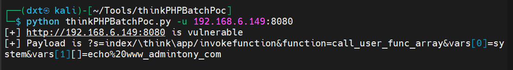

## 安装

https://github.com/admintony/thinkPHPBatchPoc.git

## 使用

用python运行thinkPHPBatchPoc.py

有两个用法：

```bash
python thinkPHPBatchPoc.py -u target_URL  //地址扫描
python thinkPHPBatchPoc.py -f target.txt  //批量扫描
```

这个软件只能扫描出修改GET请求头从而进行攻击的，例如CVE-2018-20062的远程执行漏洞就不能扫描出来，因为他是用POST进行攻击的

