## 1、信息收集

```bash
#1、网络信息收集
arp-scan -l -I eth0
===>
192.168.6.158   08:00:27:ca:61:36       PCS Systemtechnik GmbH

#2、端口信息收集
nmap -sV -Pn -p- 192.168.6.158
===>
22/tcp open  ssh     OpenSSH 9.2p1 Debian 2 (protocol 2.0)
80/tcp open  http    Apache httpd 2.4.57 ((Debian))
Service Info: OS: Linux; CPE: cpe:/o:linux:linux_kernel
```

尝试hydra爆破该ssh端口，结果发现其只允许使用密钥登录

**尝试hydra爆破root用户和admin用户**（网页用户登录处爆破）（爆出来了个密码， 但是尝试登录不对）

```bash
#疑问：为什么爆出来的这个密码登录不对？hydra也会出一些错误？
```

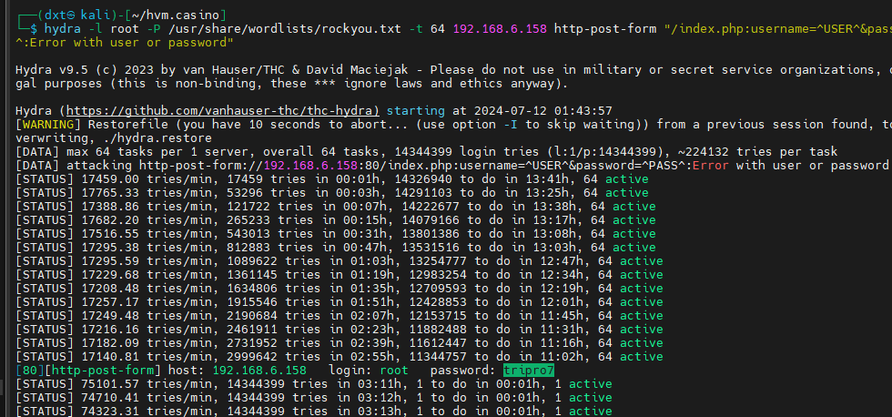

继而访问80端口,发现其index.php页面为登陆页面。

尝试对User、Password字段用sqlmap扫描，未发现sql注入

注册一个用户，dxt:999，利用该正确的用户名+口令尝试进行http头注入，未发现sql注入（这表明注册页面大概率也不会有注入点了）


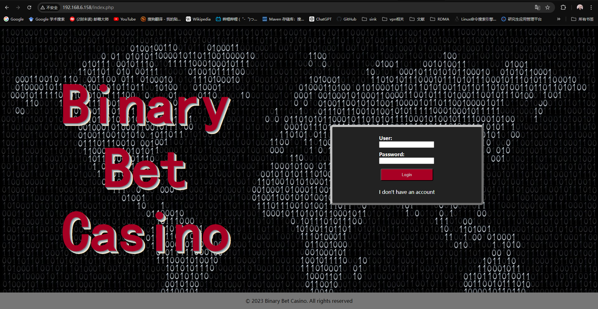

继续收集信息，爆破网站路径

爆破网站所有路径

```bash
gobuster dir -w /usr/share/dirbuster/wordlists/directory-list-2.3-medium.txt -u "http://192.168.6.158/" -x php,zip,bak,jpg,txt,html
===>
/.php                 (Status: 403) [Size: 278]
/.html                (Status: 403) [Size: 278]
/index.php            (Status: 200) [Size: 1138]
/register.php         (Status: 200) [Size: 1347]
/template.html        (Status: 200) [Size: 1170]
/imgs                 (Status: 301) [Size: 313] [--> http://192.168.6.158/imgs/]
/js                   (Status: 301) [Size: 311] [--> http://192.168.6.158/js/]
/logout.php           (Status: 302) [Size: 0] [--> /index.php]
/config.php           (Status: 200) [Size: 0]
/casino               (Status: 301) [Size: 315] [--> http://192.168.6.158/casino/]
/styles               (Status: 301) [Size: 315] [--> http://192.168.6.158/styles/]
/robots.txt           (Status: 200) [Size: 12]
/restricted.php       (Status: 302) [Size: 0] [--> ../index.php]
/.php                 (Status: 403) [Size: 278]
/.html                (Status: 403) [Size: 278]
/server-status        (Status: 403) [Size: 278]

gobuster dir -w /usr/share/dirbuster/wordlists/directory-list-2.3-medium.txt -u "http://192.168.6.158/casino/" -x php,zip,bak,jpg,txt,html
===>
/.php                 (Status: 403) [Size: 278]
/index.php            (Status: 302) [Size: 0] [--> ../index.php]
/.html                (Status: 403) [Size: 278]
/games                (Status: 301) [Size: 321] [--> http://192.168.6.158/casino/games/]
/games.php            (Status: 302) [Size: 0] [--> ../index.php]
/head.php             (Status: 302) [Size: 0] [--> ../index.php]
/instructions.txt     (Status: 200) [Size: 1721]
/.html                (Status: 403) [Size: 278]
/.php                 (Status: 403) [Size: 278]
```

都没发现什么有用的东西，开始玩第一个cups游戏，尝试找突破点

对cups游戏进行sql注入测试，没发现问题

对算数游戏进行测试，没发现sql注入

对猜和游戏测试，没发现sql注入


## 2、本地文件包含获取ssh私钥

**没有思路了，看wp**

发现在金额为0时会重定向到一个特殊的路径，该路径存在远程文件包含

于是开启一个http服务，写入一个php反弹shell命令，发现确实可以访问，但是全都执行不了，用unicode编码也执行不了

**继续看wp**，发现还可以试试本地文件包含

用ffuf爆破所有本地端口，看看能不能访问到什么

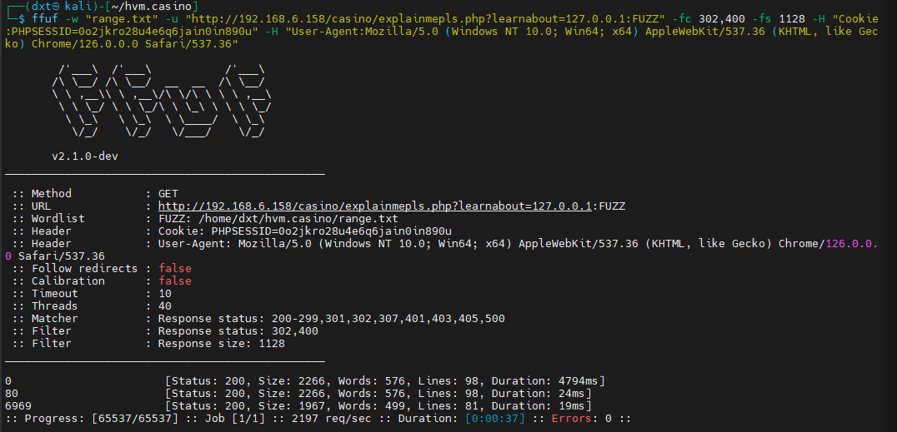

80端口和6969端口挨着扫一下，80端口和从外界访问扫出来的结果一样甚至还不如外界扫能访问的文件多，唯一就是这个URL编码的文件，?RID=2671,感觉是不是有sql注入，测试后发现没有注入

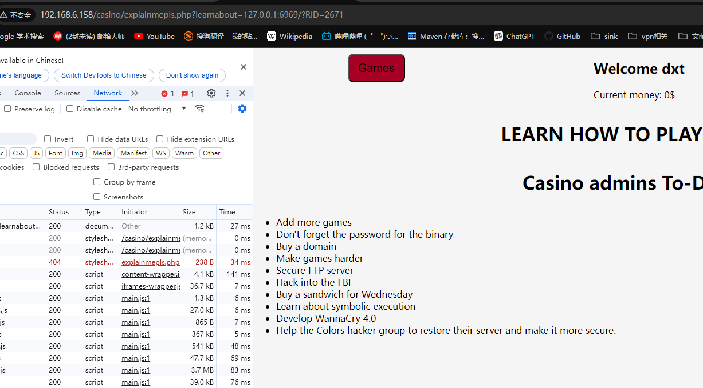

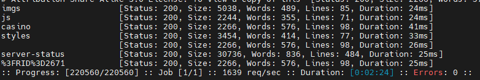

再扫6969，发现了codebreakers，访问一下看看，没啥东西。

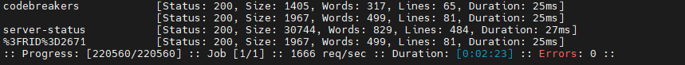

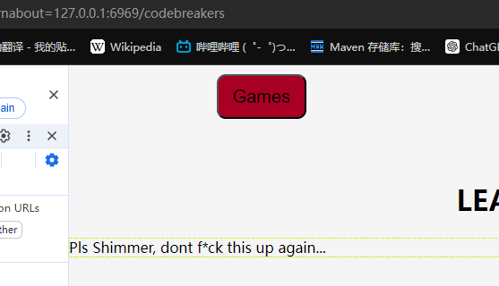

继续扫codebreakers下边，发现也没啥东西

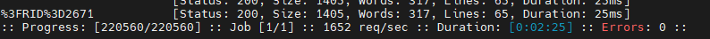


**没思路了看WP**发现是一个ssh私钥的文件路径隐藏在codebreakers页的html中（完全没想到能这样）


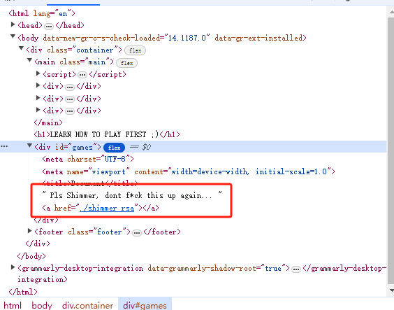

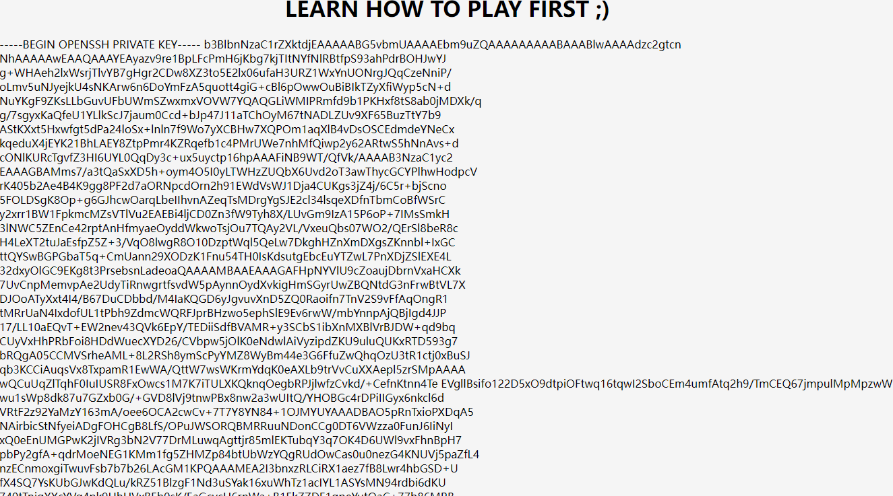

用私钥ssh登录shimmer，发现私钥格式不对，原来是浏览器直接复制下来的有些部分多了空格


## 3、权限提升

先查看当前路径，隐藏文件没有特殊的。user.txt中有一行数据casinousergobrrr，su gobrrr一下发现不存在这个用户，暂时不清楚这句话什么意思。继续查看pass，发现pass可执行并且被设置了SUID位，但是他需要密码，也利用不了。其它文件查看后没发现特别之处

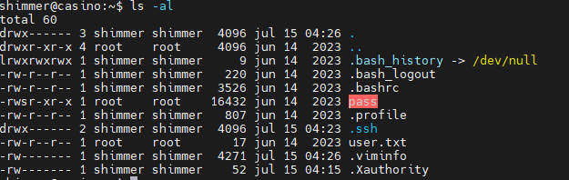

strings pass查看一下，发现有一个特殊的文件/opt/root.pass，应该就是需要输入root密码才能运行.pass，pass的hash大概率是在这个文件下

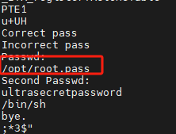


先sudo -l无法查看，再看SUID和SGID，查了一下这些可执行文件都无法提权

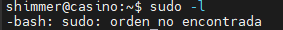

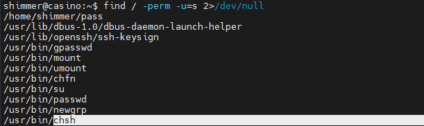

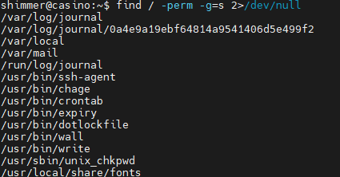

再查看开机启动项，cront.d、cron.hourly、cron.daily、crontab都查看一遍，没有定时运行的脚本是对shimmer可写的。

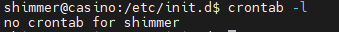

看一下开机自启脚本，全都对shimmer不可写

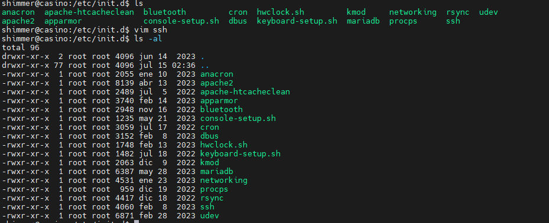

看一下chfconfig开机自启服务，直接没有这个命令

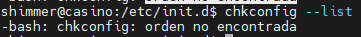


进行不下去了，感觉突破点就只有pass那个文件

**看WP发现**突破点确实是这个pass，但是要用IDA逆向，安装并学一下IDA

需要学一个z3库的使用，先跳过，先打出来再回去看这个库怎么用

运行以后发现打开了一个sh，whoami看一下发现还是shimmer权限。

想不明白了，**继续看wp**，发现重点不在于打开这个sh，而是运行该程序时程序打卡了个/opt/root.pass文件，而该文件没有关闭，所以运行程序以后可以去管道里把这个文件给揪出来

```bash
#疑问：这个pass可执行文件是被设置了SUID位，那么也就是说shimmer运行这个可执行文件的时候是以root权限运行的，那也就是说在运行可执行文件时，在这个程序中打开的任何文件都是以root权限打开的。可为什么以root权限运行的可执行文件打开的root.pass这个文件的句柄竟然是shimmer的？我感觉这个fd应该还是root拥有才对吧？
#额外的：我保持该pass运行，打开了一个新的shell发现在self里是找不到3这个fd的，但是在那个进程里是可以找到3这个fd的，但是没法重定向打开查看，为什么在这个新的shell里就查看不到了？
```

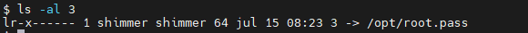


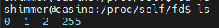

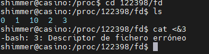