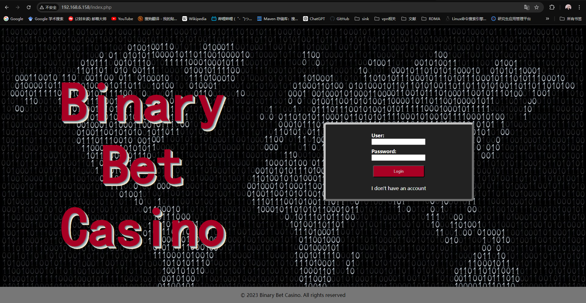

## 1、信息收集

```bash
#1、网络信息收集
arp-scan -l -I eth0
===>
192.168.6.158   08:00:27:ca:61:36       PCS Systemtechnik GmbH

#2、端口信息收集
nmap -sV -Pn -p- 192.168.6.158
===>
22/tcp open  ssh     OpenSSH 9.2p1 Debian 2 (protocol 2.0)
80/tcp open  http    Apache httpd 2.4.57 ((Debian))
Service Info: OS: Linux; CPE: cpe:/o:linux:linux_kernel
```

尝试hydra爆破该ssh端口，结果发现其只允许使用密钥登录

**尝试hydra爆破root用户和admin用户**（未结束）

继而访问80端口,发现其index.php页面为登陆页面。

尝试对User、Password字段用sqlmap扫描，未发现sql注入

注册一个用户，dxt:999，利用该正确的用户名+口令尝试进行http头注入，未发现sql注入（这表明注册页面大概率也不会有注入点了）




继续收集信息，爆破网站路径

爆破网站所有路径

```bash
gobuster dir -w /usr/share/dirbuster/wordlists/directory-list-2.3-medium.txt -u "http://192.168.6.158/" -x php,zip,bak,jpg,txt,html
===>
/.php                 (Status: 403) [Size: 278]
/.html                (Status: 403) [Size: 278]
/index.php            (Status: 200) [Size: 1138]
/register.php         (Status: 200) [Size: 1347]
/template.html        (Status: 200) [Size: 1170]
/imgs                 (Status: 301) [Size: 313] [--> http://192.168.6.158/imgs/]
/js                   (Status: 301) [Size: 311] [--> http://192.168.6.158/js/]
/logout.php           (Status: 302) [Size: 0] [--> /index.php]
/config.php           (Status: 200) [Size: 0]
/casino               (Status: 301) [Size: 315] [--> http://192.168.6.158/casino/]
/styles               (Status: 301) [Size: 315] [--> http://192.168.6.158/styles/]
/robots.txt           (Status: 200) [Size: 12]
/restricted.php       (Status: 302) [Size: 0] [--> ../index.php]
/.php                 (Status: 403) [Size: 278]
/.html                (Status: 403) [Size: 278]
/server-status        (Status: 403) [Size: 278]

gobuster dir -w /usr/share/dirbuster/wordlists/directory-list-2.3-medium.txt -u "http://192.168.6.158/casino/" -x php,zip,bak,jpg,txt,html
===>
/.php                 (Status: 403) [Size: 278]
/index.php            (Status: 302) [Size: 0] [--> ../index.php]
/.html                (Status: 403) [Size: 278]
/games                (Status: 301) [Size: 321] [--> http://192.168.6.158/casino/games/]
/games.php            (Status: 302) [Size: 0] [--> ../index.php]
/head.php             (Status: 302) [Size: 0] [--> ../index.php]
/instructions.txt     (Status: 200) [Size: 1721]
/.html                (Status: 403) [Size: 278]
/.php                 (Status: 403) [Size: 278]
```

都没发现什么有用的东西，开始玩第一个cups游戏，尝试找突破点

对cups游戏进行sql注入测试，没发现问题，但发现一个规律：只要返回的参数是win=2就是赢了，win=1就是输了

对算数游戏进行测试，没发现sql注入