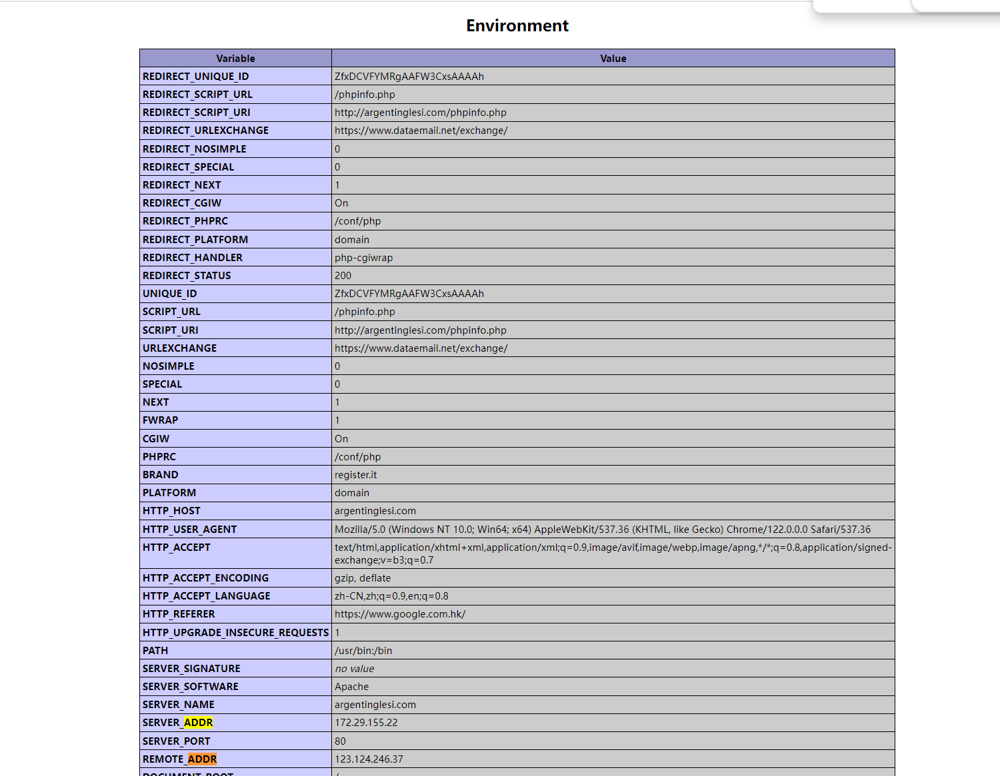

## whois

用来查询域名是否被注册，以及域名相关的数据库详细信息。

原理是向对方的TCP 43号端口建立连接，然后发送关键字回车换行，查看返回的信息

## 子域名信息收集

site:域名  //搜索此域名下的子域名（google语法）

crt.sh   developers.facebook.com/tools/ct/search   //收集域名的所有ssl证书信息

JSFinder  //git上的python脚本，爬取某个网站的源代码上的子域名（需要网页跳转，所以源代码上会有）

layer子域名挖掘机  //爆破子域名，向域名发送信息看是否回复为200

OneForAll  //最强大， 但是需要配置，大概率花钱

subDomainBrute   //python脚本，git获得

## IP反查域名

http://ip.tool.chinaz.com      //利用ip查该ip所在服务器上的所有系统域名，这种攻击称为旁注

## CDN绕过

1、http://ping.chinaz.com   //多地ping判断用没用CDN

2、https://asm.ca.com/en/ping.php   //用国外服务器ping以绕过CDN（因为CDN按照流量收费，网站管理员没有把CDN服务挂在国外）

3、https://ip.tool.chinaz.com/ipbatch   //查询子域名的ip，前提是主站和子网站在同一个服务器上，因为很多只主站做了cdn，子站点可能没有用cdn

4、phpinfo.php  //Apache的一个默认信息，管理员可能忘了删，可以显示出来该网站的ip信息

可以用在google种用inurl:phpinfo.php找到这样的信息

5、https://search.censys.io/    //用网络空间搜索引擎直接查询其真实ip，包括censys、fofa、soudan、钟馗之眼等，输入以下命令查询真实ip：443.https.tls.certificate.parsed.extensions.subject_alt_name.dns_names:域名（不加https和www）

6、查询历史dns记录，因为在上cdn之前肯定解析过正确的dns，以下网站记录了这些历史dns解析记录

https://dnsdb.io/zh-cn/

https://securitytrails.com/（仅注册）

https://viewdns.infe/iphistory/（免费）

https://www.ip138.com/（免费）

## Nmap

1、基础用法

单一主机扫描:namp 192.168.1.2

子网扫描:namp 192.168.1.1/24

多主机扫描:nmap 192.168.1.1 192.168.1.10

主机范围扫描:namp 192.168.1.1-100

IP地址列表扫描:nmap -iL target.txt

扫描除指定IP外的所有子网主机:nmap 192.168.1.1/24 --exclude 192.168.1.1

扫描除文件中IP外的子网主机:nmap 192.168.1.1/24 --excludefile xxx.txt

扫描特定主机上的80,21,23端口nmap -p 80,21,23 192.168.1.1

nmap -sS -v -T4 -Pn -p 0-65535 -oN FullTCP -iL liveHosts.txt

2、关键字说明

其中-sS为SYN扫描，不打开一个完全的TCP连接，执行的很快，不需要三次五哦收，不会产生任何绘画，不会记录进系统日志，因此防止被判定为扫描攻击，速度快效率高，但需要root权限。

-Pn代表扫描之前不需要ping命令，因为有些防火墙禁ping

-iL:导入需要扫描的列表文件

-oN FullTCP：将结果标准输出到fulltcp这个文件，特别的-oG是将结果以nmap文件的格式输出到这个文件4

-O：探测操作系统的版本

-v:探测版本

-T4：第四级别的扫描速度

## 网站指纹识别

### 1、识别操作系统

ping判断：windows一般TTL为128，Linux为64。所以一般大于100是windows，几十位linux。

nmap -O

windows大小写不敏感，但是linux区分大小写

### 2、查看服务器使用的中间件

whatweb.net 直接查找

用f12找到network，f5刷新看response信息中的相关内容

wappalyzer插件，在google上的网页插件

### 3、查看使用的脚本语言

wappalyzer插件

看网页后缀

### 4、查看使用的数据库

sqlmap

### 5、cms识别

cms是不会代码的人用于管理网站内容的

http://whatweb.bugscaner.com/look/   //在线识别cms

https://github.com/iceyhexman/onlinetools    //在线识别cms

https://pentest.gdpcisa.org    //在线识别cms

### 6、敏感文件泄露

GitHub泄露

.git泄露：用githack自动扫描（git开源）

.svn泄露 

管理员误将网站备份文件或者敏感信息存放在某个目录下，可以用目录探测：

dirsearch：https://github.com/maurosoria/dirsearch

dirmap：https://github.com/H4ckForob/dirmap

### 7、Waf识别

看图识Waf：https://mp.weixin.qq.com/s/PWkqNsygi-c_S7tW1y_Hxw

### 8、历史漏洞信息利用

说白了就是用现成的历史漏洞，检测某个网站有没有防护这个漏洞

乌云镜像站 http://wy.zone.ci/

乌云知识库 https://wooyun.kieran.top/#!/

exploit-db https://www.eploit-db.com/

知道宇创seebug https://www.seebug.org/

